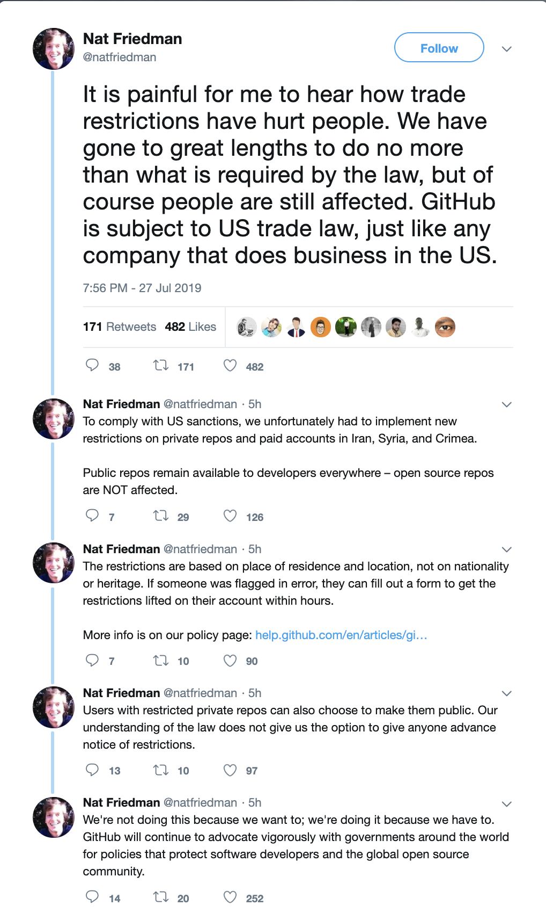

# Een bericht naar GitHub

[English](./README.md) | [简体中文](./README-CN.md) | [Español ](./README-ES.md) | [Ελληνικά](./README-GR.md) | [Italiano](./README-IT.md) | [Русский](./README-RU.md) | [فارسی](./README-PER.md) | [Française ](./README-FR.md) | [Deutsch](./README-DE.md) | [Հայերէն](./README-HY.md) | [Српски](./README-SR.md) | [العربية](./README-AR.md) | [Türkçe](./README-TR.md) | [Português do Brasil](./README-PT-BR.md) | [Nederlands](./README-NL.md) | [한국어](./README-KO.md)

**Aandacht!**
We zijn zo dankbaar voor je steun. Deze repository laat altijd zien dat mensen allemaal samen zijn tegen ongelukkige gebeurtenissen over de hele wereld.
Omdat GitHub enkele van de vorige beperkingen heeft herzien, hebben we besloten de activiteit van deze repository te verminderen. Het betekent natuurlijk niet dat we het eens zijn met de sancties en de GitHub.
We zullen een conclusie plaatsen en binnenkort meer uitleggen, wacht daar alstublieft op.
De campagne wordt beëindigd ** donderdag 1 augustus 23:59 uur (Tehran Time GMT +4: 30) **. Na deze tijd zullen we geen nieuwe PR meer samenvoegen.
Nogmaals bedankt voor je steun en vriendelijkheid
Wacht alstublieft op onze definitieve conclusie

~~**Tip:** Je kan [deze extensie](https://github.com/JafarAkhondali/remove-github-restrictions-message) of [deze extensie](https://github.com/MohamadKh75/ShutHub) of [dit tampermonkey script](https://gist.github.com/HirbodBehnam/2e079e187be0b1b6a6bcb734ed88474e) of [Stylish](https://userstyles.org/styles/173827/hide-github-warning) om warning box te verwijderen~~

**UPDATE:** De waarschuwing bericht is nu weg.

## Introductie

GitHub was vroeger een open en gratis platform voor iedereen, maar het heeft besloten om te voorkomen dat Iraanse accounts bijdragen en deel uitmaken van het open-source ecosysteem. Hoewel we begrijpen dat GitHub deze beslissing zou kunnen nemen onder druk van de Amerikaanse overheid, verwachtten we een meer respectvolle actie van GitHub.

1. GitHub beperkte onze toegang tot privérepository's plotseling, maar we wilden tenminste dat GitHub ons waarschuwde voordat we onze toegang beperkten.

2. GitHub besloot nog een stap verder te gaan en elke gebruiker die een Iraanse IP-adres ergens in hun geschiedenis gebruikte te verbieden, ongeacht waar zij / hij woont, terwijl ze de toegang door IP-adressen net als andere Amerikaanse bedrijven konden beperken. Deze actie is een soort verbod op nationaliteit.

Uiteindelijk hopen we dat het team van GitHub dat:

- Laat onze privérepository's en essenties downloaden en deze ook openbaar maken (controle instellen).
  **UPDATE:** Het is nu mogelijk om privérepository's openbaar te maken, maar deze optie is nog niet beschikbaar op private overzichten (met IDE Setting Sync-bestanden etc).
- Wijzig hun beperkingsbeleid om gebruikers niet te beperken op basis van hun nationaliteit.
- Kondig hun beslings publiekelijk aan en verontschuldig je voor het maken van deze situatie (zoals Slack eerder deed in dezelfde situatie: https://slackhq.com/an-apology-and-an-update).
- **UPDATE** GitHub page werken nu voor beperkte mensen.

## Open-sourceprojecten gemaakt door Iraanse ontwikkelaars

Enkele voorbeelden van open-sourceprojecten gemaakt door Iraanse ontwikkelaars:

- [@harfbuzz](https://github.com/harfbuzz)/[**harfbuzz**](https://github.com/harfbuzz/harfbuzz)
- [@usablica](https://github.com/usablica)/[**intro.js**](https://github.com/usablica/intro.js)
- [@lebab](https://github.com/lebab)/[**lebab**](https://github.com/lebab/lebab)
- [@saeedalipoor](https://github.com/saeedalipoor)/[**icono**](https://github.com/saeedalipoor/icono)
- [@morteza](https://github.com/morteza)/[**bootstrap-rtl**](https://github.com/morteza/bootstrap-rtl)
- [@ilius](https://github.com/ilius)/[**pyglossary**](https://github.com/ilius/pyglossary)
- [@TheSNAKY](https://github.com/TheSNAKY)/[**Lives**](https://github.com/TheSNAKY/Lives)
- [@sasanrose](https://github.com/sasanrose)/[**phpredmin**](https://github.com/sasanrose/phpredmin)
- [@ahmdrz](https://github.com/ahmdrz)/[**goinsta**](https://github.com/ahmdrz/goinsta)
- [@persepolisdm](https://github.com/persepolisdm)/[**persepolis**](https://github.com/persepolisdm/persepolis)
- [@sepandhaghighi](https://github.com/sepandhaghighi)/[**pycm**](https://github.com/sepandhaghighi/pycm)
- [@sepandhaghighi](https://github.com/sepandhaghighi)/[**art**](https://github.com/sepandhaghighi/art)
- [@imaNNeoFighT](https://github.com/imaNNeoFighT)/[**fl_chart**](https://github.com/imaNNeoFighT/fl_chart)
- [@nuxt](https://github.com/nuxt)/[**nuxt.js**](https://github.com/nuxt/nuxt.js)
- [@bootstrap-vue](https://github.com/bootstrap-vue)/[**bootstrap-vue**](https://github.com/bootstrap-vue/bootstrap-vue)
- [@wolfengine](https://github.com/wolfengine)/[**wolf.engine**](https://github.com/wolfengine/wolf.engine)
- [@soroushchehresa](https://github.com/soroushchehresa)/[**vue-soundcloud**](https://github.com/soroushchehresa/vue-soundcloud)
- [@soroushchehresa](https://github.com/soroushchehresa)/[**unsplash-wallpapers**](https://github.com/soroushchehresa/unsplash-wallpapers)

Je kan de volledige lijst [hier](https://github.com/mohebifar/made-in-iran) vinden.

## Hoe kan je ons helpen?

U kunt de boodschap overal verspreiden waar u maar kunt, en de gratis software bewaren "zoals in de vrije meningsuiting".
Jij kan:

- Star en deel deze repo op sociale platformen met ** # githubForEveryone **.
- Voeg een map met uw gebruikersnaam toe aan ["together" map] (samen).
- Schrijf een stukje code met de tekst "GitHub is voor iedereen" (in elke gewenste taal).
- Maak een pull-verzoek.
- Voeg uw naam en uw land toe aan de [supporters sectie](#supporters-list-sorted-alphabetically).

## Further Readings

- [Microsoft enters: GitHub banned Iranian developers!](https://medium.com/@d.aliyamini/microsoft-enters-github-banned-iranian-developers-843f7c60a146)
- [GitHub banned Iran-based users](https://financialtribune.com/articles/sci-tech/99111/github-bans-iran-based-users)
- [GitHub has blocked an Iranian software developer account](https://hub.packtpub.com/github-has-blocked-an-iranian-software-developers-account)
- [GitHub starts blocking developers in countries facing US trade sanctions](https://www.zdnet.com/article/github-starts-blocking-developers-in-countries-facing-us-trade-sanctions)
- [What is it like to be a dev in Iran](https://shahinsorkh.ir/2019/07/20/how-is-it-like-to-be-a-dev-in-iran)
- [I am lucky, you are not](https://dev.to/jeromegamez/i-am-lucky-you-are-not-2eco)
- [If You Don't Know, Now You Know - GitHub Is Restricting Access For Users van Iran And A Few Other Embargoed Countries](https://dev.to/mjraadi/if-you-don-t-know-now-you-know-github-is-restricting-access-for-users-van-iran-and-a-few-other-embargoed-countries-5ga9)
- [محدود شدن اکانت های ایرانی‌ها روی گیت هاب](https://jadi.net/2019/07/github-sanctions)
- [GitHub blocked my account and they think I’m developing nuclear weapons](https://medium.com/@hamed/github-blocked-my-account-and-they-think-im-developing-nuclear-weapons-e7e1fe62cb74)
- [Yellow badges are back. This time not by Nazi Germany & not for Jews, but by U.S. tech companies](https://medium.com/@hamed/yellow-badges-are-back-this-time-not-by-nazi-germany-not-for-jews-but-by-u-s-tech-companies-48e92d690176)
- [GitHub: The largest developer communities van every corner of the globe, But Iran!](https://medium.com/@khalesic/github-the-largest-developer-communities-van-every-corner-of-the-globe-but-iran-804c05a991df)
## Op sociale media

- [GitHub banned all Iranian users.](https://www.reddit.com/r/programming/comments/ciey8g/github_banned_all_iranian_users_our_accounts_are/) on Reddit
- [Dan Abramov: Wow, looking forward to getting blocked van @GitHub when US decides to sanction Russia](https://twitter.com/dan_abramov/status/1154869188672086019?s=19) on Twitter
- [Hamed Saeedi: Today @github blocked my access](https://twitter.com/Hamed/status/1154268514074660864?s=19) on Twitter
- [Behdad Esfahbod: So, recently @github has started disabling accounts of Iranian developers](https://twitter.com/behdadesfahbod/status/1154755351092158465?s=19) on Twitter
- [Nuxt.js: Our core team member @_pi0_ cannot access our private repositories anymore on @github because of US Sanctions...](https://t.co/4FiLexH9Mf) on Twitter
- [Conner Orth:Shout out for this terribly sad turn of events for our fellow Iranian developers.](https://twitter.com/conner_orth/status/1154723522729709568) on Twitter
- [Nat Friedman:We're not doing this because we want to; we're doing it because we have to.](https://twitter.com/natfriedman/status/1155311121038864384) on Twitter
- [Pooya Eimandar:@github disabled my repos without prior notice.](https://twitter.com/_poei/status/1154994262884454400) on Twitter
- [Pooya Eimandar:I've been paid github for more than three years and now I can't even export my repos because of my nationality. ](https://www.reddit.com/r/github/comments/cirde7/ive_been_paid_github_for_more_than_three_years/?st=jympkq19&sh=df5e5410) on Reddit

## Nieuws

- [GitHub allow us to make our private repositories, public](https://github.com/1995parham/github-do-not-ban-us/issues/666)

- GitHub-pagina werkt nu voor beperkte personen.

## Supporters
[Supporters lijst](/README.md#Supporters)
