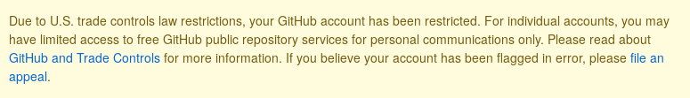

# Сообщение для GitHub

[English](./README.md) | [简体中文](./README-CN.md) | [Spanish](./README-ES.md) | [Ελληνικά](./README-GR.md) | [Italiano](./README-IT.md) | Русский

Совет: Можно использовать [это расширение](https://github.com/MohamadKh75/ShutHub) чтобы скрыть жёлтое сообщение!

## Вступление

GitHub был открытой и бесплатной платформой для всех, но GitHub решил запретить иранским аккаунтам участвовать в развитии open-source экосистемы. Хотя мы понимаем, что GitHub мог принять это решение под давлением правительства США, но мы ожидали от GitHub более уважительного поведения.

1. GitHub внезапно ограничил нам доступ к приватным репозиториям, мы бы хотели хотя бы получить уведомление перед блокировкой.

2. Команда GitHub решила сделать шаг назад и ограничить нас, **основываясь на нашей национальности**, назависимо от того, где мы живём, но пока они смогли заблокировать нас только по IP адресам, как и многие компании из США.

Мы надеемся, что команда Github:

- Позволит нам скачать наши приватные репозитории и также сделать их публичными (Контроль настроек)
- Сменит свою политику ограничений и не будет блокировать пользователей по национальному признаку.
- Публично объявит о своём решении извиниться за возникшую ситуацию (Например, как Slack делал раньше https://slackhq.com/an-apology-and-an-update).

## Open-source проекты созданные иранскими разработчиками

Несколько примеров open-source проектов созданных иранскими разработчиками:

https://github.com/usablica/intro.js

https://github.com/lebab/lebab

https://github.com/saeedalipoor/icono

https://github.com/morteza/bootstrap-rtl

https://github.com/ilius/pyglossary

https://github.com/TheSNAKY/Lives

https://github.com/sasanrose/phpredmin

https://github.com/ahmdrz/goinsta

https://github.com/persepolisdm/persepolis

https://github.com/sepandhaghighi/pycm

https://github.com/sepandhaghighi/art

https://github.com/imaNNeoFighT/fl_chart

Полный список доступен [здесь](https://github.com/mohebifar/made-in-iran).

## Как вы можете помочь нам

Вы можете распространять эту информацию, где только можете, чтобы защитить статус Свободного ПО.

Также можно:

- Поставить звезду этому репозиторию и поделиться им в социальных сетях с тегом #githubForEveryone.
- Добавить папку с вашим юзернеймом в папку "Together"
- Написать программу, которая выводит "GitHub is for everyone" (На любом языке)
- Создать pull-реквест
- Добавить своё имя и страну в секцию suppoters в README.md

## Дальнейшее чтение

- [Microsoft enters: GitHub banned Iranian developers!](https://medium.com/@d.aliyamini/microsoft-enters-github-banned-iranian-developers-843f7c60a146)
- [GitHub banned Iran-based users](https://financialtribune.com/articles/sci-tech/99111/github-bans-iran-based-users)
- [GitHub has blocked an Iranian software developer account](https://hub.packtpub.com/github-has-blocked-an-iranian-software-developers-account)
- [GitHub starts blocking developers in countries facing US trade sanctions](https://www.zdnet.com/article/github-starts-blocking-developers-in-countries-facing-us-trade-sanctions)
