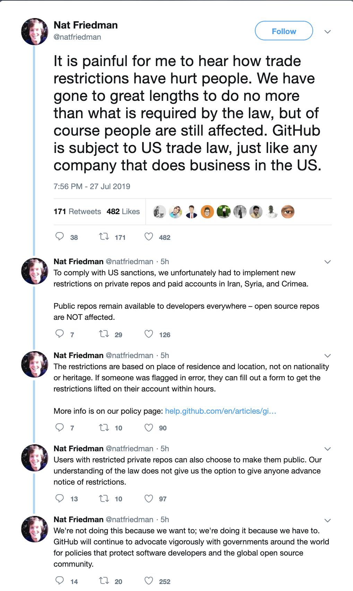

# A Message to GitHub

English | [简体中文](./README-CN.md) | [Español ](./README-ES.md) | [Ελληνικά](./README-GR.md) | [Italiano](./README-IT.md) | [Русский](./README-RU.md) | [فارسی](./README-PER.md) | [Française ](./README-FR.md) | [Deutsch](./README-DE.md) | [Հայերէն](./README-HY.md) | [Српски](./README-SR.md) | [العربية](./README-AR.md) | [Türkçe](./README-TR.md) | [Português do Brasil](./README-PT-BR.md) | [Nederlands](./README-NL.md) | [한국어](./README-KO.md)

~~**Tip:** You can use [this extension](https://github.com/JafarAkhondali/remove-github-restrictions-message) or [this extension](https://github.com/MohamadKh75/ShutHub) or [this tampermonkey script](https://gist.github.com/HirbodBehnam/2e079e187be0b1b6a6bcb734ed88474e) or [Stylish](https://userstyles.org/styles/173827/hide-github-warning) to hide this yellow box!~~

**UPDATE:** The warning message is dismissable now.

## Introduction

GitHub used to be an open and free platform for everyone, but it has decided to restrict Iranian accounts from contributing and being part of the open-source ecosystem. Although we understand GitHub might make this decision under the pressure of US government, we were expecting a more respectful action from GitHub.

1. GitHub restricted our access to private repositories suddenly, but at the very least we wanted GitHub to warn us before limiting our access.

2. GitHub decided to take one step further and ban every user that used Iran's IP address somewhere their history no matter where she/he is living, while they could just restrict access by IP address like other US-based companies. This action is kind of ban by nationality.

Eventually, we are hoping that GitHub's team will:

- Let us download our private repositories and gists and also make them public (setting control).
  **UPDATE:** It is possible now to make private repositories public, however this option is not available on private gists (containing IDE Setting Sync files etc.) yet.
- Change their restriction policies so as to not limit users based on their Nationality.
- Announce their decision publicly and apologize for making this situation (like what Slack did before in the same situation: https://slackhq.com/an-apology-and-an-update).
- **UPDATE** GitHub page are now working for restricted persons.

## Open-source projects made by Iranian developers

Some examples of open-source projects created by Iranian developers:

- [@harfbuzz](https://github.com/harfbuzz)/[**harfbuzz**](https://github.com/harfbuzz/harfbuzz)
- [@usablica](https://github.com/usablica)/[**intro.js**](https://github.com/usablica/intro.js)
- [@lebab](https://github.com/lebab)/[**lebab**](https://github.com/lebab/lebab)
- [@saeedalipoor](https://github.com/saeedalipoor)/[**icono**](https://github.com/saeedalipoor/icono)
- [@morteza](https://github.com/morteza)/[**bootstrap-rtl**](https://github.com/morteza/bootstrap-rtl)
- [@ilius](https://github.com/ilius)/[**pyglossary**](https://github.com/ilius/pyglossary)
- [@TheSNAKY](https://github.com/TheSNAKY)/[**Lives**](https://github.com/TheSNAKY/Lives)
- [@sasanrose](https://github.com/sasanrose)/[**phpredmin**](https://github.com/sasanrose/phpredmin)
- [@ahmdrz](https://github.com/ahmdrz)/[**goinsta**](https://github.com/ahmdrz/goinsta)
- [@persepolisdm](https://github.com/persepolisdm)/[**persepolis**](https://github.com/persepolisdm/persepolis)
- [@sepandhaghighi](https://github.com/sepandhaghighi)/[**pycm**](https://github.com/sepandhaghighi/pycm)
- [@sepandhaghighi](https://github.com/sepandhaghighi)/[**art**](https://github.com/sepandhaghighi/art)
- [@imaNNeoFighT](https://github.com/imaNNeoFighT)/[**fl_chart**](https://github.com/imaNNeoFighT/fl_chart)
- [@nuxt](https://github.com/nuxt)/[**nuxt.js**](https://github.com/nuxt/nuxt.js)
- [@bootstrap-vue](https://github.com/bootstrap-vue)/[**bootstrap-vue**](https://github.com/bootstrap-vue/bootstrap-vue)
- [@wolfengine](https://github.com/wolfengine)/[**wolf.engine**](https://github.com/wolfengine/wolf.engine)
- [@soroushchehresa](https://github.com/soroushchehresa)/[**vue-soundcloud**](https://github.com/soroushchehresa/vue-soundcloud)
- [@soroushchehresa](https://github.com/soroushchehresa)/[**unsplash-wallpapers**](https://github.com/soroushchehresa/unsplash-wallpapers)

You can find the full list [here](https://github.com/mohebifar/made-in-iran).

## How you can support us

You can spread the message everywhere you can, and keep the Free Software "as in Free speech".
You can:

- Star and share this repo on social platforms with **#githubForEveryone**.
- Add a folder with your username in ["together" folder](together).
- Write a piece of code that prints "GitHub is for everyone" (in any language you wish).
- Create a pull request.
- Add your name and your country to the [supporters section](#supporters).

## Further Readings

- [Microsoft enters: GitHub banned Iranian developers!](https://medium.com/@d.aliyamini/microsoft-enters-github-banned-iranian-developers-843f7c60a146)
- [GitHub banned Iran-based users](https://financialtribune.com/articles/sci-tech/99111/github-bans-iran-based-users)
- [GitHub has blocked an Iranian software developer account](https://hub.packtpub.com/github-has-blocked-an-iranian-software-developers-account)
- [GitHub starts blocking developers in countries facing US trade sanctions](https://www.zdnet.com/article/github-starts-blocking-developers-in-countries-facing-us-trade-sanctions)
- [What is it like to be a dev in Iran](https://shahinsorkh.ir/2019/07/20/how-is-it-like-to-be-a-dev-in-iran)
- [I am lucky, you are not](https://dev.to/jeromegamez/i-am-lucky-you-are-not-2eco)
- [If You Don't Know, Now You Know - GitHub Is Restricting Access For Users From Iran And A Few Other Embargoed Countries](https://dev.to/mjraadi/if-you-don-t-know-now-you-know-github-is-restricting-access-for-users-from-iran-and-a-few-other-embargoed-countries-5ga9)
- [محدود شدن اکانت های ایرانی‌ها روی گیت هاب](https://jadi.net/2019/07/github-sanctions)
- [GitHub blocked my account and they think I’m developing nuclear weapons](https://medium.com/@hamed/github-blocked-my-account-and-they-think-im-developing-nuclear-weapons-e7e1fe62cb74)
- [Yellow badges are back. This time not by Nazi Germany & not for Jews, but by U.S. tech companies](https://medium.com/@hamed/yellow-badges-are-back-this-time-not-by-nazi-germany-not-for-jews-but-by-u-s-tech-companies-48e92d690176)
- [Github: The largest developer communities from every corner of the globe, But Iran!](https://medium.com/@khalesic/github-the-largest-developer-communities-from-every-corner-of-the-globe-but-iran-804c05a991df)
## On Social Networks

- [GitHub banned all Iranian users.](https://www.reddit.com/r/programming/comments/ciey8g/github_banned_all_iranian_users_our_accounts_are/) on Reddit
- [Dan Abramov: Wow, looking forward to getting blocked from @GitHub when US decides to sanction Russia](https://twitter.com/dan_abramov/status/1154869188672086019?s=19) on Twitter
- [Hamed Saeedi: Today @github blocked my access](https://twitter.com/Hamed/status/1154268514074660864?s=19) on Twitter
- [Behdad Esfahbod: So, recently @github has started disabling accounts of Iranian developers](https://twitter.com/behdadesfahbod/status/1154755351092158465?s=19) on Twitter
- [Nuxt.js: Our core team member @_pi0_ cannot access our private repositories anymore on @github because of US Sanctions...](https://t.co/4FiLexH9Mf) on Twitter
- [Conner Orth:Shout out for this terribly sad turn of events for our fellow Iranian developers.](https://twitter.com/conner_orth/status/1154723522729709568) on Twitter
- [Nat Friedman:We're not doing this because we want to; we're doing it because we have to.](https://twitter.com/natfriedman/status/1155311121038864384) on Twitter
- [Pooya Eimandar:@github disabled my repos without prior notice.](https://twitter.com/_poei/status/1154994262884454400) on Twitter
- [Pooya Eimandar:I've been paid github for more than three years and now I can't even export my repos because of my nationality. ](https://www.reddit.com/r/github/comments/cirde7/ive_been_paid_github_for_more_than_three_years/?st=jympkq19&sh=df5e5410) on Reddit

## News

- [GitHub allow us to make our private repositories, public](https://github.com/1995parham/github-do-not-ban-us/issues/666)

- GitHub page are now working for restricted persons.

## Supporters

- Rustam from Russia 🇷🇺 ([rs-hub](https://github.com/rs-hub/))
- Marwen from Germany 🇩🇪 ([mtrabelsi](https://github.com/mtrabelsi))
- MohamadKh75 from Iran 🇮🇷 ([MohamadKh75](https://github.com/MohamadKh75))
- Amir Masud Zare Bidaki from Iran 🇮🇷 ([amirmasud](https://github.com/amirmasud))
- Hamed Hajiloo from Iran 🇮🇷 ([HamedHajiloo](https://github.com/hamedhajiloo))
- Wilson Flores [wilsson](https://github.com/wilsson) from 🇵🇪
- Marco Aceti from Italy 🇮🇹 ([MarcoBuster](https://github.com/MarcoBuster))
- Daniil Gentili from Italy and Russia 🇮🇹 🇷🇺 ([danog](https://github.com/danog))
- Seamus Donnellan from Australia 🇦🇺 ([donnellan0007](https://github.com/donnellan0007))
- Brennen Green from the United States ([brennegreen](https://github.com/brennengreen))
- Conner Orth from Netherlands 🇳🇱
- Chris C from Luxembourg 🇱🇺
- micheleriva from Italy 🇮🇹
- Angel Uniminin from Iceland 🇮🇸
- Fahim from Bangladesh 🇧🇩
- divinity1437 from Russia 🇷🇺
- Enzo from France 🇫🇷
- Edgar from 🇦🇲 ([EdgarAmirbekian](https://github.com/edgaramirbekian))
- Appadeia from the United States 🇺🇸
- Zhiwa from China 🇨🇳 ([zhiwa](https://github.com/aboutmydreams))
- Junbo Li from China 🇨🇳 ([Adhders](https://github.com/Adhders))
- Alexander Shelepenok from Belarus 🇧🇾
- Ran Luo from China 🇨🇳
- Zhu Zihao from China 🇨🇳 ([cireu](https://github.com/cireu))
- 88250 from China 🇨🇳 ([88250](https://github.com/88250))
- mighty9245 from Russia 🇷🇺
- speccius from UK 🇬🇧
- Benjamin Hogué from Guadeloupe 🇬🇵
- fredddie from Mexico 🇲🇽
- AbdElmomen Kadhim ([bluemix](https://github.com/bluemix))
- Sadra Hallaj from Iran 🇮🇷 ([sadrahallaj](https://github.com/sadrahallaj))
- 1995parham from Iran 🇮🇷 ([1995parham](https://github.com/1995parham))
- pesehr from Iran 🇮🇷 ([pesehr](https://github.com/pesehr))
- Ahmad Salimi from Iran 🇮🇷 ([ahmadsalimi](https://github.com/ahmadsalimi))
- Alireza Mahmoudian from Iran 🇮🇷 ([BelegCuthalion](https://github.com/BelegCuthalion))
- Amirhossein Yaghoobi from Iran 🇮🇷 ([amir-yaghoobi](https://github.com/amir-yaghoobi))
- Marjan Jangholi from Iran 🇮🇷 ([jangholi](https://github.com/jangholi))
- Romain from France 🇫🇷 ([maoschanz](https://github.com/maoschanz))
- Hussein Habibi Juybari from Iran 🇮🇷 ([husseinhj](https://github.com/Husseinhj))
- Mahdi Ghiasi from Iran 🇮🇷 ([MahdiGhiasi](https://github.com/MahdiGhiasi))
- Ali Tavalaie from Iran 🇮🇷 ([tavallaie](https://github.com/tavallaie))
- rajabiseraji from Iran 🇮🇷
- Saman Fekri from Iran 🇮🇷 ([SamanFekri](https://github.com/SamanFekri))
- Sina Sheikholeslami from Iran 🇮🇷 ([ssheikholeslami](https://ssheikholeslami.github.io))
- Muhammad Hussein Fattahizadeh from Iran 🇮🇷 ([mhf-ir](https://github.com/mhf-ir))
- Reza Bayat from Iran 🇮🇷 ([RezaBayat](https://github.com/rezabayat76))
- Rashad Ansari from Iran 🇮🇷 ([RashadAnsari](https://github.com/RashadAnsari))
- Sam Johnson from the United States 🇺🇸 ([sam0x17](https://github.com/sam0x17))
- Farid Forootan Shad from Iran 🇮🇷 ([faridfor](https://github.com/faridfor))
- Vahid Bazzaz from Iran 🇮🇷 ([vahidbazzaz](https://github.com/vahidbazzaz))
- Iman Khoshabbi from Iran 🇮🇷 ([imaNNeoFighT](https://github.com/imaNNeoFighT))
- iyotetsuya from Taiwan 🇹🇼 ([iyotetsuya](https://github.com/iyotetsuya))
- Muhammad Javad Falahi from Iran 🇮🇷 ([MJFalahi](https://github.com/MJFalahi))
- Sina Darvishi from Iran 🇮🇷 ([SinaDarvi](https://github.com/SinaDarvi))
- Adib Faramarzi from Iran 🇮🇷 ([adibfara](https://github.com/adibfara))
- Abolfazl Amiri from Iran 🇮🇷 ([aasmpro](https://github.com/aasmpro))
- Taher Ahmadi from Iran 🇮🇷 ([taherahmadi](https://github.com/taherahmadi))
- Dermohamad from Iran 🇮🇷 ([dermohamad](https://twitter.com/dermohamad))
- Ali Ghahremani from Iran 🇮🇷 ([ali77gh](https://github.com/ali77gh))
- Ali Izadi from Iran 🇮🇷 ([aliizadi](https://github.com/aliizadi))
- Milad Nekofar ([nekofar](https://github.com/nekofar))
- Nikan Dalvand ([nikandlv](https://github.com/nikandlv))
- Alireza Torabian from Iran 🇮🇷 ([1997alireza](https://github.com/1997alireza))
- Ali Irani from Iran 🇮🇷 ([aliir74](https://github.com/ali74))
- Alireza Jahanshahlou from Iran 🇮🇷 ([a-jahanshahlo](https://github.com/a-jahanshahlo))
- jocs from China 🇨🇳 ([jocs](https://github.com/Jocs))
- Mihir Chaturvedi from India 🇮🇳 ([plibither8](https://github.com/plibither8))
- Jérôme Gamez from Germany 🇩🇪 ([jeromegamez](https://github.com/jeromegamez))
- Mohammadreza Samadi from Iran 🇮🇷 ([MhmDSmdi](https://github.com/MhmDSmdi))
- Sepehr Sameni from Iran 🇮🇷 ([Separius](https://github.com/Separius))
- Habib Kazemi from Iran 🇮🇷 ([kazemihabib](https://github.com/kazemihabib))
- Amir Baghaie from Iran 🇮🇷 ([amirbagh75](https://github.com/amirbagh75))
- Ehsan Mohammadi from Iran 🇮🇷 ([ehsan-mohammadi](https://github.com/ehsan-mohammadi))
- Erfan Gholamian from Iran 🇮🇷 ([erfan-gh](https://github.com/erfan-gh))
- Ali MohammadPur 🇮🇷 ([alimpfard](https://github.com/alimpfard))
- Mostafa Ghadimi from Iran 🇮🇷 ([MostafaGhadimi](https://github.com/mostafaghadimi))
- Max Base ([BaseMax](https://github.com/BaseMax))
- MohammadHossein Shojaeinia from Iran 🇮🇷 ([MohammadHosseinShojaeinia](https://github.com/MohammadShojaeinia))
- Mostafa Asadi from Iran 🇮🇷 ([MostafaAsadi](https://github.com/mostafaasadi))
- Erfan Alimohammadi from Iran 🇮🇷 ([Erfaniaa](https://github.com/Erfaniaa))
- Dharani Akurathi from India ([Dharni0607](https://github.com/Dharni0607))
- Saleh Salehizadeh from Iran 🇮🇷 ([SirSaleh](https://github.com/SirSaleh))
- Ehsan Souri from Iran 🇮🇷 ([ehsansouri23](https://github.com/ehsansouri23))
- Navid Sarhady from Iran 🇮🇷 ([nawwid](https://github.com/nawwid))
- Saman Khamesian from Iran 🇮🇷 ([SamanKhamesian](https://github.com/SamanKhamesian))
- Andrii Siriak from Ukraine ([siriak](https://github.com/siriak))
- Mehran Rasoli from Iran 🇮🇷 ([mehranrasoli](https://github.com/mehranrasoli))
- Adnan Babakan from Iran 🇮🇷 ([AdnanBabakan](http://github.com/AdnanBabakan))
- Ali Molaei from Iran 🇮🇷 ([molaeiali](https://github.com/molaeiali))
- mehran motiee from Iran 🇮🇷 ([straxico](http://github.com/straxico))
- Alireza Tarazani from Iran 🇮🇷 ([ImanX](https://github.com/ImanX))
- Ali Sharifi from Iran 🇮🇷 ([alisharifi2000](https://github.com/alisharifi2000))
- Sepand Haghighi from Iran 🇮🇷 ([sepandhaghighi](https://github.com/sepandhaghighi))
- Bahman Shams from Iran 🇮🇷 ([bahmanshams](https://github.com/bahmanshams))
- Ali Gholami from Iran 🇮🇷 ([aligholami](https://github.com/aligholami))
- Amirali Esfandiari from Iran 🇮🇷 ([univa64](https://github.com/univa64))
- Hamed Mirzaei from Iran 🇮🇷 ([hamedmiir](https://github.com/hamedmiir))
- Amir Haqiqati ([anewage](https://github.com/anewage))
- Morteza T. from Iran 🇮🇷 ([yekanchi](https://github.com/yekanchi))
- Peter Nelson from the United States 🇺🇸 ([pdtnelson](https://github.com/pdtnelson))
- Mohamad Fadavi ([fadavi](https://github.com/fadavi))
- Mojtaba Valipour from Iran 🇮🇷 ([mvpcom](https://github.com/mvpcom))
- Arman Hosseini from Iran 🇮🇷 ([arman-hosseini](https://github.com/arman-hosseini))
- Abdellah Chadidi from Morocco 🇲🇦 ([chadidi](https://github.com/chadidi))
- Karim Oulad Chalha from Morocco 🇲🇦 ([karim88](https://github.com/karim88/))
- Ali Amirnezhad from Iran 🇮🇷 ([webilix](https://github.com/webilix))
- Sarah Akhavan Kazemzadeh ([sarahakhavan](https://github.com/sarahakhavan))
- WenlongLiu from China 🇨🇳 ([gitors](https://github.com/gitors))
- Muhammad Azhdari from 🇮🇷 ([Muhammad Azhdari](https://github.com/mmdaz))
- Ehsan Ahmadi from Iran 🇮🇷 ([ehsana94](https://github.com/ehsana94))
- Ali Farazdaghi from Iran 🇮🇷 ([alifarazz](https://github.com/alifarazz))
- Michael Power from Canada 🇨🇦 ([mwpower](https://github.com/mwpower))
- Mehran Rafiee from Iran 🇮🇷 ([mehran75](https://github.com/mehran75))
- Mateus Gabi Moreira from Brazil 🇧🇷 ([mateusgabi](https://github.com/mateusgabi))
- Matheus Graciano from Brazil 🇧🇷 ([graciano](https://github.com/graciano))
- Mehmet Alp Turkey ([mehmetakifalp](https://github.com/mehmetakifalp))
- Mahmoud Eskandari from Iran 🇮🇷 ([mahmoud](https://github.com/mahmoud-eskandari))
- Haider Ali Punjabi ([haideralipunjabi](https://github.com/haideralipunjabi))
- Tariqul Islam from Bangladesh 🇧🇩 ([ta-riq](https://github.com/ta-riq))
- Giovanni Nuño from Mexico 🇲🇽 ([gionuno](https://github.com/gionuno))
- Kave Mohammadi from Iran 🇮🇷 ([keomd](https://github.com/keomd))
- Sogrey from China 🇨🇳 ([Sogrey](https://github.com/Sogrey))
- tristone13th from China 🇨🇳 ([tristone13th](https://github.com/tristone13th))
- Mohammad Ali Toufighi from Iran 🇮🇷 ([alitoufighi](https://github.com/alitoufighi))
- Mostafa Rowghanian from Iran 🇮🇷 ([keomd](https://github.com/mostafatech))
- Duncan Sparks from the United States 🇺🇸 ([DuncanSparks](https://github.com/DuncanSparks))
- Shahrokh Moghimi from Iran 🇮🇷 ([shaahrokh](https://github.com/shaahrokh))
- Natnij from China 🇨🇳 ([natnij](https://github.com/natnij))
- Ibtehaz Shawon from Bangladesh 🇧🇩 ([ibtehaz-shawon](https://github.com/ibtehaz-shawon))
- fzsdi from Iran 🇮🇷 ([fzsdi](https://github.com/fzsdi))
- Kamyar Gerami from Iran 🇮🇷 ([kam2yar](https://github.com/kam2yar))
- Mehran Mahmoudkhani from Iran 🇮🇷 ([mome13](https://github.com/mome13))
- Siamak A.Motlagh from Iran 🇮🇷 ([blacksrc](https://github.com/blacksrc))
- Hadi Khaghani from Iran 🇮🇷 ([khaqani](https://github.com/khaqani))
- Parsa Khosh from Iran 🇮🇷 ([parsakhosh](https://github.com/parsakhosh))
- Reza Kakhki from Iran 🇮🇷 ([elk-cloner](https://github.com/elk-cloner/))
- Mohammad Eftekhari from Iran 🇮🇷 ([bluemmb](https://github.com/bluemmb))
- Yasin Amini from Iran 🇮🇷 ([yasinEnigma](https://github.com/yasinEnigma/))
- Ahmad Sharif from Iran 🇮🇷 ([bluemmb](https://github.com/ahmadrezash))
- Davyd McColl from South Africa 🇿🇦 ([fluffynuts](https://github.com/fluffynuts))
- Erfan Gholizade from Iran 🇮🇷 ([erfantkerfan](https://github.com/erfantkerfan))
- Vincent Weevers from Netherlands 🇳🇱 ([vweevers](https://github.com/vweevers))
- Ali Salehi from Iran 🇮🇷 ([AliSalehi](https://github.com/salehiali1374))
- Mohammad Javad Naderi from Iran 🇮🇷 ([mjnaderi](https://github.com/mjnaderi))
- Alireza Sahebi from Iran 🇮🇷 ([alirzasahb](https://github.com/alirzasahb))
- Ruslan Gunawardana from Ukraine 🇺🇦 ([exarus](https://github.com/exarus))
- Amir Shokri From Iran 🇮🇷 ([amirshnll](https://github.com/amirshnll))
- Omid Rafiee from Iran 🇮🇷 ([OmidRafiee](https://github.com/OmidRafiee))
- Ali Tavafi from Iran 🇮🇷 ([Tavafi](https://github.com/Tavafi))
- Saeed Mohagheghi from Iran 🇮🇷 ([saeedmhq](https://github.com/saeedmhq))
- Sukka from China 🇨🇳 ([SukkaW](https://github.com/SukkaW))
- Erfan Mehraban from Iran 🇮🇷 ([erfan-mehraban](https://github.com/erfan-mehraban))
- Seyed Hossein Hosseini from Iran 🇮🇷 ([DiniMad](https://github.com/DiniMad))
- Seyed Ali Salmabadi from Iran 🇮🇷 ([salis77](https://github.com/salis77))
- Louay Al-osh from Syria 🇸🇾 ([lalosh](https://github.com/lalosh))
- Mohammad Hussein Tavakoli Bina from Iran 🇮🇷 ([mhtb32](https://github.com/mhtb32))
- Ali Yazdi from Iran 🇮🇷 ([aliyazdi75](https://github.com/aliyazdi75))
- Mohammad Mehdi Ahmadi from Iran 🇮🇷 ([TZAB2MA](https://github.com/TZAB2MA))
- Ali Salehi from Iran 🇮🇷 ([4lisalehi](https://github.com/4lisalehi))
- Mahdi Salmanzadeh from Iran 🇮🇷 ([Salmanzadeh](https://github.com/mahdisn76))
- Seyed Ali Shahrokhi from Iran 🇮🇷 ([Alishahrokhiii](https://github.com/Alishahrokhiii))
- Sina Dalvand from Iran 🇮🇷 ([sinadalvand](https://github.com/sinadalvand))
- Mohammad Mahabadi from Iran 🇮🇷 ([thisismahabadi](https://github.com/thisismahabadi))
- Bohan Wang from China 🇨🇳 ([Cygra](https://github.com/Cygra))
- AmirhoseiN Aliakbarian Iran 🇮🇷 ([amirhoseinaliakbarian](https://github.com/amirhoseinaliakbarian))
- Hamidreza Moallem Taheri from Iran 🇮🇷 ([hrmt2000](https://github.com/hrmt2000))
- Seyed Morteza Kamali from Iran 🇮🇷 ([Kamali](https://github.com/smkplus))
- Iman Heydarifrom from Iran 🇮🇷 ([hamyarwoo](https://github.com/hamyarwoo))
- Reza Aghajani from Iran 🇮🇷 ([jrezaw](https://github.com/jrezaw))
- Yanshigou from China 🇨🇳 ([yanshigou](https://github.com/yanshigou))
- Alireza Faghani from Iran 🇮🇷 ([Faghani](https://github.com/faghani))
- Erkan Özkök from Turkey 🇹🇷 ([nozkok](https://github.com/nozkok))
- Yhlben from China 🇨🇳 ([yhlben](https://github.com/yhlben))
- Ali Bakhtiar from Iran 🇮🇷 ([alibakhtiar](https://github.com/alibakhtiar))
- Abdus from India 🇮🇳 ([thisisabdus](https://github.com/thisosabdus))
- Mohammad Alijani from Iran 🇮🇷 ([virtualdemon](https://github.com/virtualdemon))
- Laster K. from UK 🇬🇧 ([lazerl0rd](https://github.com/lazerl0rd))
- Ali Nasir from Iran 🇮🇷 ([Ali Nasir](https://github.com/Ali-Nasir-01))
- Erfan Mahdavi form Iran 🇮🇷 ([erfanwd](https://github.com/erfanwd))
- Mohsen Darestani Farahani from Iran 🇮🇷 ([8lueMeth](https://github.com/8luemeth))
- Amirerfanr Rafati from Iran 🇮🇷 ([erfanr](https://github.com/erfanr))
- Ali Bakhtiar from Iran 🇮🇷 ([Faghani](https://github.com/alibakhtiar))
- Amir Hossein Sojoodi from Iran 🇮🇷 ([amirsojoodi](https://github.com/amirsojoodi))
- Rahmanism from Iran 🇮🇷 ([Rahmansim](https://github.com/Rahmanism))
- Ivanq from Russia 🇷🇺 ([imachug](https://github.com/imachug/))
- Vaibhav Khulbe from India 🇮🇳 ([Kvaibhav01](https://github.com/Kvaibhav01))
- Hamid Taheri from Iran 🇮🇷 ([H4mit](https://github.com/h4mit/))
- Jan Krüger from Germany 🇩🇪 ([waterfl0w](https://github.com/waterfl0w))
- Cosmin-Petru Nechifor from Romania 🇷🇴 ([cosminnechifor](https://github.com/CosminNechifor/))
- Mindaugas Vaitiekūnas from Lithuania 🇱🇹 ([mindaugasw](https://github.com/mindaugasw))
- Ebrahim Hamzeh from Iran 🇮🇷 ([EbrahimHamzeh](https://github.com/EbrahimHamzeh))
- binbin huang from China 🇨🇳 ([hbb](https://github.com/nocanstillbb))
- Sina Kachoei from Iran 🇮🇷 ([sinakachoei](https://github.com/sinakachoei/))
- Farzad Sharbafian from Iran 🇮🇷 ([farzadshbfn](https://github.com/farzadshbfn/))
- Fırat Eşki from Turkey 🇹🇷 ([firateski](https://github.com/firateski))
- Hamid Rahmani from Iran 🇮🇷 ([hamiiiiiiid](https://github.com/Hamiiiiiiid))
- mrtarkhan From Iran 🇮🇷 ([mrtarkhan](https://github.com/mrtarkhan))
- Morteza Nokhodian from Germany 🇩🇪 ([nokhodian](https://github.com/nokhodian))
- Barzin Assa from Iran 🇮🇷 ([Barzin144](https://github.com/barzin144))
- Caspian Baska from Australia 🇦🇺 ([caspiano](https://github.com/caspiano))
- Saeid Doroudi from Iran 🇮🇷 ([doroudi](https://github.com/doroudi))
- Mohammad Ganji from Iran 🇮🇷 ([MohGanji](https://github.com/MohGanji/))
- Parham from Iran 🇮🇷 ([parhambz](https://github.com/parhambz))
- Alireza Heydari from Iran 🇮🇷 ([alirezahi](https://github.com/alirezahi))
- Mohammad Amin Chitgarha from Iran 🇮🇷 ([MAChitgarha](https://github.com/MAChitgarha/))
- Anand Chowdhary from India and Netherlands 🇮🇳 🇳🇱 ([AnandChowdhary](https://github.com/AnandChowdhary))
- Nima Amiri from Iran 🇮🇷 ([MAChitgarha](https://github.com/arc92))
- Farshad Jahanmanesh from Iran 🇮🇷 ([farshadjahanmanesh](https://github.com/farshadjahanmanesh/))
- Saeed Salhi from Iran 🇮🇷 ([1SaeedSalehi](https://github.com/1saeedsalehi/))
- Naser Nourani from Iran 🇮🇷 ([MAChitgarha](https://github.com/nnourani/))
- Mohammad Moallemi from Iran 🇮🇷 ([mmoallemi99](https://github.com/mmoallemi99/))
- Amin Nazari from Iran 🇮🇷 ([aminNazarii](https://github.com/aminNazarii/))
- Hirbod Behnam from Iran 🇮🇷 ([HirbodBehnam](https://github.com/HirbodBehnam/))
- Mohammad Ali Sadraei from Iran 🇮🇷 ([mohalisad](https://github.com/mohalisad/))
- Reza Hosseinzadeh from Iran 🇮🇷 ([Rezamax](https://github.com/rezamax))
- Amin Rashidbeigi from Iran 🇮🇷 ([aminrashidbeigi](https://github.com/aminrashidbeigi/))
- Pouya Kary from Iran 🇮🇷 ([pmkary](https://github.com/pmkary/))
- Milad Barazandeh from Iran 🇮🇷 ([miladbarazandeh](https://github.com/miladbarazandeh/))
- Himself65 from China 🇨🇳 ([Himself65](https://github.com/himself65/))
- Alireza Edalatpour from Iran 🇮🇷 ([alirezaed](https://github.com/alirezaed/))
- twofist from Germany 🇩🇪 ([twofist](https://github.com/twofist))
- Ali Jalali from Iran 🇮🇷 ([aliprogrammer69](https://github.com/aliprogrammer69/))
- Aref M Mehr from Iran 🇮🇷 ([arefmq](https://github.com/arefmq/))
- Shahrokh Mirzayee from Iran 🇮🇷 ([shahrokh-mi](https://github.com/shahrokh-mi))
- Armin Abbasi from Iran 🇮🇷 ([armin-abbasi](https://github.com/armin-abbasi))
- Sepehr Taghdisian from Iran 🇮🇷 ([septag](https://github.com/septag))
- Amin Mirzaee from Iran 🇮🇷 ([hifeamin](https://github.com/hifeamin/))
- Sarah Aziziyan from Iran 🇮🇷 ([SarahAziziyan](https://github.com/sarahaziziyan/))
- Mohammad Bagherani from Iran 🇮🇷 ([Bagherani](https://github.com/bagherani/))
- Aref Hosseini from Iran 🇮🇷 ([arefhosseini](https://github.com/arefhosseini/))
- xtlsoft from China 🇨🇳 ([xtlsoft](https://github.com/xtlsoft/))
- Mohammad Salek from Iran 🇮🇷 ([MohammadSalek](https://github.com/MohammadSalek))
- b1sergiu from Romania 🇷🇴 ([b1sergiu](https://github.com/b1sergiu/))
- Mohammad Reza Kamalifard from Iran 🇮🇷 ([Reza Kamalifard](https://github.com/rezakamalifard/))
- Andrii Kovalchuk from Ukraine 🇺🇦 ([tieorange](https://github.com/tieorange/))
- Scvoet from China 🇨🇳 ([scvoet](https://github.com/scvoet/))
- Mehrad Sadeghi from Iran 🇮🇷 ([mehradsadeghi](https://github.com/mehradsadeghi/))
- Amir Ramezani from Iran 🇮🇷 ([brightening-eyes](http://github.com/brightening-eyes))
- Dylan Cutler from the United States 🇺🇸 ([DCtheTall](https://github.com/DCtheTall))
- Fateme Bahrami from Iran 🇮🇷 ([fatibahrami771998](https://github.com/fatibahrami771998))
- Saleh from Saudi Arabia 🇸🇦 ([qirh](https://github.com/qirh/))
- Hesam Kaveh from Iran 🇮🇷 ([hesamkaveh](https://github.com/hesamkaveh/))
- Mohammad Ghonchesefidi from Iran 🇮🇷 ([ghonchesefidi](https://github.com/gonchesefidi))
- Ru Chern Chong from Singapore 🇸🇬 ([ruchern](https://github.com/ruchern))
- Jonas Gierer from Germany 🇩🇪 ([jgierer12](https://github.com/jgierer12))
- Alireza Sheikholmolouki from Iran 🇮🇷 ([alireza29675](https://github.com/alireza29675))
- Daniel Caldas from Portugal 🇵🇹 ([danielcaldas](https://github.com/danielcaldas))
- Alireza Zerafati from Iran 🇮🇷 ([azerafati](https://github.com/azerafati))
- SnailMann from China 🇨🇳 ([SnailMann](https://github.com/SnailMann))
- Hamid from Iran 🇮🇷 ([progHamid](https://github.com/progHamid/))
- [Ron](https://github.com/ron-wolf) with ❤️ from the United States and Israel 🇺🇸 🇮🇱
- Axel Rindle from Germany 🇩🇪 ([axelrindle](https://github.com/axelrindle))
- Jason Kraus from the United States 🇺🇸 ([zbyte64](https://github.com/zbyte64))
- Nabil Tharwat from Egypt 🇪🇬 ([KL13NT](https://github.com/KL13NT))
- Mrloder from Spain 🇪🇸
- Houari ZEGAI from Algeria 🇩🇿 [HouariZegai](https://github.com/HouariZegai)
- Hamid R. K. PishGhadam from Iran 🇮🇷 ([hamidrezakp](https://github.com/hamidrezakp))
- Morteza Omidian Iran 🇮🇷
- A C Sreedhar Reddy from India 🇮🇳 ([a-c-sreedhar-reddy](https://github.com/a-c-sreedhar-reddy))
- Kittinan from Thailand 🇹🇭 ([kittinan](https://github.com/kittinan))
- Matthew Parnell from UK 🇬🇧 ([parnmatt GitLab](https://gitlab.com/parnmatt), [parnmatt GitHub](https://github.com/parnmatt))
- Imed Adel from Tunisia 🇹🇳 ([ImedAdel](https://github.com/ImedAdel))
- Praveen Kumar Saini from India 🇮🇳 ([praveen-me](https://github.com/praveen-me))
- Mahuton from Benin 🇧🇯 ([Mahuton](https://github.com/Mahuton))
- Hamed Zargaripour from Iran 🇮🇷 ([zargaripour](https://github.com/zargaripour))
- George Ho from Hong Kong 🇭🇰 ([eigenfoo](https://github.com/eigenfoo))
- Muhammad Babayi from Iran 🇮🇷 ([chiefmb](https://github.com/chiefmb))
- Liam from UK 🇬🇧 ([Xerbo](https://github.com/Xerbo))
- Mariam Arab from Canada 🇨🇦 ([mariamarab](https://github.com/mariamarab))
- Cuong Nguyen from Vietnam 🇻🇳 ([cuongw](https://github.com/cuongw))
- Arseniy Graur from Russia 🇷🇺 ([argraur](https://github.com/argraur))
- Mehmet Kaykısız from Turkey 🇹🇷 ([mkaykisiz](https://github.com/mkaykisiz))
- MSadeghzadehG from Iran 🇮🇷 ([MSadeghzadehG](https://github.com/MSadeghzadehG))
- Ali Piry from Iran 🇮🇷 ([alipiry](https://github.com/alipiry))
- Morteza From Iran 🇮🇷 ([asadise](https://github.com/asadise))
- Erfan Abedi from Iran 🇮🇷 ([TheErfan](https://github.com/TheErfan))
- Mohammad Najafian from Iran 🇮🇷 ([loverdeveloper](https://github.com/loverdeveloper/))
- Omar2535 from Canada 🇨🇦 ([omar2535](https://github.com/omar2535))
- Orestis Ousoultzoglou from Greece 🇬🇷 ([xlxs4](https://github.com/xlxs4))
- Armin Monirzadeh from Iran 🇮🇷 ([arminmon](https://github.com/arminmon/))
- Angus L. Fraser from UK 🇬🇧
- MatteoPieroni from Italy 🇮🇹 ([MatteoPieroni](https://github.com/matteopieroni))
- Faiyaz Shaikh from India 🇮🇳 ([Faiyaz Shaikh](https://github.com/yTakkar))
- Adaobi Frank from Nigeria 🇳🇬 ([droidada](https://github.com/droidada))
- Abdelhak Bougouffa from Algeria 🇩🇿 ([abougouffa](https://abougouffa.github.io))
- tipok from Germany 🇩🇪 ([tipok](https://github.com/tipok))
- Shreyas Minocha from India 🇮🇳 ([shreyasminocha](ahttps://github.com/shreyasminoch))
- Md Narimani ([mnarimani](https://github.com/mnarimani))
- Mahdi Dibaiee from Iran 🇮🇷 ([mdibaiee](https://github.com/mdibaiee))
- Charles Jacquin from France 🇫🇷 ([charjac](https://github.com/charjac))
- Alejandro González-Pérez from Spain 🇪🇸 ([algope](https://github.com/algope))
- Persian Prince from Iran 🇮🇷 ([persianpros](https://github.com/persianpros))
- Hadi Mahdavi from Iran 🇮🇷 ([IoT](https://github.com/expandboard))
- Farshid Roohi from Iran 🇮🇷 ([farshidroohi](https://github.com/farshidroohi))
- Soroush Chehresa from Iran 🇮🇷 ([soroushchehresa](https://github.com/soroushchehresa))
- Lpmvb from China 🇨🇳
- NabilTheNoise from Iran 🇮🇷 ([Dragon96nfs](https://github.com/dragon96nfs))
- Heman from the United States 🇺🇸 ([hemangandhi](https://github.com/hemangandhi/)
- KT from China and the United States 🇨🇳 🇺🇸 ([KTachibanaM](https://github.com/KTachibanaM/))
- Vincent Hyvert from France 🇫🇷 ([vinceh121](https://github.com/vinceh121/))
- Samundra Khatri from Nepal 🇳🇵 ([samundrak](https://github.com/samundrak))
- Ahad Chowdhury from Bangladesh 🇧🇩 ([maacpiash](https://github.com/maacpiash))
- Ajithkumar from India 🇮🇳 ([ajithkumarsekar](https://github.com/Ajithkumarsekar))
- Tobias aka. TheDevMinerTV from Germany 🇩🇪 ([TheDevMinerTV](https://github.com/TheDevMinerTV/))
- Muhammad Yaseen from Pakistan 🇵🇰 ([Yaseen](https://github.com/muhammadyaseen))
- Francisco Sánchez from Chile 🇨🇱 ([fransafu](https://github.com/fransafu/))
- Inline Harper from China 🇨🇳 ([Afanyiyu](https://github.com/Afanyiyu))
- Karol Kulik from Poland 🇵🇱 ([MrK191](https://github.com/MrK191))
- Mahdi Hosseini from Iran 🇮🇷 ([ghost1372](https://github.com/ghost1372))
- Daniel Kvasnicka from Czechia and the United States 🇨🇿 🇺🇸 ([dkvasnicka](https://github.com/dkvasnicka))
- Ahmad Habannakeh from Syria 🇸🇾 ([abnud1](https://github.com/abnud1))
- Mohammad Mahdi Rostamzadeh from Iran 🇮🇷 ([favecode](https://github.com/favecode))
- Lewis Conroy from Scotlabd ([Lewis Conroy](https://github.com/captainkinney))
- jkmpariab from iran 🇮🇷 ([jkmpariab](https://github.com/jkmpariab))
- Jordan Hart from the United States 🇺🇸 ([jordanhart](https://github.com/jordanhart))
- Mohsen Khanpour from Iran 🇮🇷 ([mohsenkhanpour](https://github.com/mohsenkhanpour))
- Nima Amiri from Iran 🇮🇷 ([Nimak](https://github.com/arc92))
- Tyler from the United States 🇺🇸 ([arctair](https://github.com/arctair))
- Andreas Basurto from the United States 🇺🇸 ([nitrohorse](https://github.com/nitrohorse))
- MohammadHossein Bagheri from Iran 🇮🇷 ([PyBagheri](https://github.com/PyBagheri))
- Amir M. Joshaghani from 🇮🇷 ([AMJoshaghani](https://github.com/amjoshaghani))
- Isabelle L. from the United States 🇺🇸 ([ilsko](https://github.com/ilsko))
- Mavromatakis Dimitris from Greece 🇬🇷 ([damavrom](https://gitlab.com/damavrom))
- Piotr Kazimierski from Poland 🇵🇱 ([inquis1t0r](https://github.com/Inquis1t0r/))
- Eziy from Germany 🇩🇪 ([eziy](https://github.com/eziy))
- Amir mohammad Naderi from Iran 🇮🇷 ([amiiir](https://github.com/amiiir))
- Jose Pita from from Portugal 🇵🇹 ([jpita](https://github.com/jpita/))
- Ravi from India 🇮🇳 ([xolve](https://github.com/xolve))
- Mohammad Hadi Hosseinpour from Iran 🇮🇷 ([hadi77ir](https://github.com/hadi77ir))
- Erfan Momeni from Iran 🇮🇷 ([MomeniErfan](https://github.com/MomeniErfan))
- Mohsen from Canada 🇨🇦 ([DarkChocolate](https://github.com/DarkChocolate))
- Melika Barzegaran from Iran 🇮🇷 ([melikabarzegaran](https://github.com/melikabarzegaran))
- Abdullrahman Al-Zeidi from Oman 🇴🇲 ([AbdullrahmanAlzeidi](https://github.com/AbdullrahmanAlzeidi))
- Igor from Poland 🇵🇱 ([igorpos](https://github.com/igorpos))
- Bishoy Melek from Egypt 🇪🇬 ([bishoymelek](https://github.com/bishoymelek))
- Duong Nguyen from Vietnam 🇻🇳 ([you-create](https://github.com/you-create))
- Artur Kondas from Poland 🇵🇱 ([youshy](https://github.com/youshy))
- James from China 🇨🇳 ([jamesyangget](https://github.com/jamesyangget))
- Mohammad Zare Moghadam 🇮🇷 ([thisismzm](https://github.com/thisismzm))
- Eli Bierman from the United States 🇺🇸 ([edbedbe](https://github.com/edbedbe))
- Ali Tabatabaei from Iran 🇮🇷 ([AliTabatabaeiAT](https://github.com/alitabatabaeiat))
- Liam Kenneth from England ([Liam Kenneth](https://github.com/LiamKenneth))
- Aiden Wallis from the United Kingdom ([AidenWallis](https://github.com/AidenWallis))
- Amine Mouafik from Thailand 🇹🇭 ([kytwb](https://github.com/kytwb))
- Gerasimos Maropoulos from Greece 🇬🇷 ([kataras](https://github.com/kataras))
- f-person from Armenia 🇦🇲 ([f-person](https://github.com/f-person))
- Gokul Swaminathan from the United States 🇺🇸 ([JavaCafe01](https://github.com/JavaCafe01))
- Lucas Bittencourt from Brazil 🇧🇷 ([lucasnaja](https://github.com/lucasnaja))
- Thomas from United States 🇺🇸 ([Hakerh400](https://github.com/Hakerh400))
- Danny Kamps from The Netherlands 🇳🇱 ([Dkamps18](https://github.com/Dkamps18))
- Lokimonoton from Indonesia 🇮🇩 ([lokimonoton](https://github.com/lokimonoton))
- Sivuyile Magutywa from South Africa 🇿🇦
- S. Mahdi Mir-Ismaili from Iran 🇮🇷 ([mirismaili](https://github.com/mirismaili))
- Charles Milette from Canada 🇨🇦 ([sylveon](https://github.com/sylveon))
- Simon Lecutiez from France 🇫🇷 ([soetz](https://github.com/soetz))
- Madiodio Gaye from Senegal 🇸🇳 ([madiodio](https://github.com/madiodio))
- RealPG from China 🇨🇳 ([realpg](https://github.com/realpg))
- Ben Barnes from Australia 🇦🇺 ([ben-barnes](https://github.com/ben-barnes/))
- Barce from the United States 🇺🇸 ([barce](https://github.com/barce))
- Adem Kouki from Tunisia 🇹🇳 ([Ademking](https://gitlab.com/Ademking))
- George Zou from China 🇨🇳 ([GeorgeZou](https://github.com/georgezouq))
- AliReza Sadeghi from Iran 🇮🇷 ([aliraza7926](https://github.com/aliraza7926))
- Benjamin Sherman from the United States 🇺🇸([benjaminrsherman](https://gitlab.com/benjaminrsherman))
- Navid Khazaee form Iran 🇮🇷 ([nkhdiscovery](https://github.com/nkhdiscovery))
- Elan Bustos from the United States 🇺🇸([elanlb](https://github.com/elanlb))
- Mo Zargham from Canada 🇨🇦🇮🇷 ([Mozar10](https://github.com/Mozar10))
- Eltrac from China 🇨🇳 ([BigCoke233](https://github.com/BigCoke233))
- Pashootan Vaezipoor from Iran and Canada 🇮🇷 🇨🇦 ([CpHaddock](https://github.com/CpHaddock))
- Serene Husni from Jordan and Canada 🇯🇴 🇨🇦
- fugio from armenia 🇦🇲 ([fugio](https://github.com/fugio))
- Vimiix Yao from China 🇨🇳 ([vimiix](https://github.com/vimiix))
- Ali Ranjbarzadeh from Iran ([AliRanjbarzadeh](https://github.com/AliRanjbarzadeh)
- Mehdi Dehghani from Iran ([dehghani-mehdi](https://github.com/dehghani-mehdi))
- Ahmad Aghazadeh from Iran ([ahmadaghazadeh](https://github.com/ahmadaghazadeh))
- Jennifer Shehane from United States 🇺🇸 ([jennifer-shehane](https://github.com/jennifer-shehane))
- Daniel Lalasa ([daniellalasa2](https://github.com/daniellalasa2))
- Mohammad Ali Amini from Iran ([hakhsin](https://github.com/hakhsin))
- Naser Nourani from Iran 🇮🇷 ([NNourani](https://github.com/nnourani/))
- Sandy Chen from China 🇨🇳 ([sandy2008](https://github.com/sandy2008))
- Kitten King from India 🇮🇳 ([kittenking](https://github.com/kittenking))
- meysam gheysaryan from IR ([meysam7289](https://github.com/meysam7289))
- Saman Zahedi from Iran 🇮🇷 ([thezahedi](https://github.com/thezahedi))
- Jason C. McDonald from United States 🇺🇸 ([codemouse92](https://github.com/codemouse92))
- Masoud Tavakkoli from Iran 🇮🇷 ([ProMasoud](https://github.com/ProMasoud))
- Hossein Mohammadi from Iran 🇮🇷 ([hosseinmd](https://github.com/hosseinmd))
- Shakiba Moshiri from Iran 🇮🇷 ([k-five](https://github.com/k-five))
- Stephen Yin from China 🇨🇳 ([hacker0limbo](https://github.com/hacker0limbo))
- MohammadAmin SamiAzar from Iran 🇮🇷 ([SamiAzar](https://github.com/samiazar))
- Mostafa Khaki from Iran ([mosi-kha](https://github.com/mosi-kha))
- Javad Gholampoor from Iran 🇮🇷 ([javad10170](https://github.com/javad10170))
- Seyed Hossein (sedhossein) Hosseini from Iran 🇮🇷 ([sedhossein](https://github.com/sedhossein))
- Doyin Olarewaju from Nigeria 🇳🇬 ([gate3](https://github.com/gate3))
- Erfan Ahmadi from Iran 🇮🇷 ([Erfan-Ahmadi](https://github.com/Erfan-Ahmadi))
- Robert de Bock from The Netherlands 🇳🇱 ([robertdebock](https://github.com/robertdebock))
- Alireza Zolanvari from Iran 🇮🇷 ([alirezazolanvari](https://github.com/alirezazolanvari))
- Babak K. Shandiz from Iran 🇮🇷 ([babakks](https://github.com/babakks))
- Pooya Parsa from Iran 🇮🇷 ([pi0](https://github.com/pi0))
- Adam Yi from China and Australia 🇨🇳 🇦🇺 ([adamyi](https://github.com/adamyi))
- Seyed Abbas Ghomi from Iran 🇮🇷 ([SeyedAbbasGhomi](https://github.com/SeyedAbbasGhomi))
- Alexander J. from Australia 🇦🇺 ([alexanderj2357](https://github.com/alexanderj2357))
- Wilhelm Behncke from Germany 🇩🇪 ([grebaldi](https://github.com/grebaldi))
- Khashayar Ghamati from Iran 🇮🇷 ([khashayarghamati](https://github.com/khashayarghamati))
- Ajay Rawat from India 🇮🇳 ([hello-ajayrawat](https://github.com/hello-ajayrawat))
- Hamid from from Iran 🇮🇷 ([progHamid](https://github.com/progHamid))
- HamidReza Adib from Iran 🇮🇷 ([hamidrezaadib](https://github.com/hamidrezaadib))
- Salman Amintabar from Iran 🇮🇷 ([amintabar](https://github.com/amintabar))
- Mohammad Ebrahimi Aval from Iran 🇮🇷 ([ebrahimiaval](https://github.com/ebrahimiaval))
- Mohamed Anees from India 🇮🇳 ([mohamedanees6](https://github.com/mohamedanees6))
- Soroush Kavousi from Iran 🇮🇷 ([bitianist](https://github.com/bitianist))
- Navid Emami from Iran 🇮🇷 ([novid](https://github.com/novid))
- Max Strübing from Germany 🇩🇪([mstruebing](https://github.com/mstruebing))
- Ali Kavani from Iran 🇮🇷 ([subzerobo](https://github.com/subzerobo))
- Amer Lotfi Orimi from Iran 🇮🇷 ([amerllica](https://github.com/amerllica))
- Amir Hossein Mirzaei from Iran 🇮🇷 ([amirc901](https://github.com/amirc901))
- Mehran Goudarzi from Iran 🇮🇷 ([Mehran](https://github.com/Mehran))
- Ali Hassanabadi from Iran 🇮🇷 ([AHassanabadi](https://github.com/AHassanabadi))
- Ehsan Mahmoudi from Iran 🇮🇷 ([jeyem](https://github.com/jeyem/))
- Stijn Segers from Belgium 🇧🇪 ([Borromini](https://github.com/Borromini))
- Ali Abdollahi from Iran 🇮🇷 ([aabdollahi](https://github.com/aabdollahi))
- Trinity Pointard from France 🇫🇷 ([fdb-hiroshima](https://github.com/fdb-hiroshima/))
- Udo Kramer from Germany 🇩🇪 ([optikfluffel](https://github.com/optikfluffel))
- Ali Sameni from Iran 🇮🇷 ([aliwesome](https://github.com/aliwesome))
- Vahid Sadeghizadeh from Iran 🇮🇷 ([vsadeghizade](https://github.com/vsadeghizade))
- Kiarash Zarinmehr from Iran 🇮🇷 ([Kiarash-Z](https://github.com/Kiarash-Z))
- Carvell Scott from the United States ([CarvellScott](https://github.com/CarvellScott))
- Pooya Eimandar from Iran 🇮🇷 ([pooyaeimandar](https://github.com/pooyaeimandar))
- Shayan Karami from Iran 🇮🇷 ([Shayank](https://github.com/Shayank))
- Milad GanjAli from Iran 🇮🇷 ([miladganjali](https://github.com/miladganjali))
- Ali Madihi from Iran 🇮🇷 ([mrunderline](https://github.com/mrunderline))
- Amir Zandi from Iran 🇮🇷 ([amirzandi](https://github.com/amirzandi))
- Saud from India 🇮🇳 ([rottencandy](https://github.com/rottencandy))
- Parsa Torbati from Iran 🇮🇷 ([poyynt](https://github.com/poyynt))
- Céleste Cinti from France 🇫🇷 ([Leytere](https://github.com/Leytere))
- Amir Habibzadeh from Iran 🇮🇷 ([amirhabibzadeh](https://github.com/amirhabibzadeh))
- Mahdi Razavi from Iran 🇮🇷 ([m-razavi](https://github.com/m-razavi))
- Bofei Wang China 🇨🇳 ([bofeiw](https://github.com/bofeiw))
- Ali Joghataei from Iran 🇮🇷 ([ali-joghataei](https://github.com/ali-joghataei))
- Saeed Bibak from Iran 🇮🇷 ([saeedbibak](https://github.com/saeedbibak))
- Kevin Pennarun from France 🇫🇷 ([kepennar](https://github.com/kepennar))
- Kizito Akhilome from Nigeria 🇳🇬 ([akhilome](https://github.com/akhilome))
- Arman Safikhani from Iran 🇮🇷 ([Arman92](https://github.com/arman92))
- Pooya Barati from Iran 🇮🇷 ([pooyabarati](https://github.com/pooyabarati))
- Ron from the UK 🇬🇧 ([Noisytoot](https://github.com/Noisytoot))
- Ahmad Khani from Iran 🇮🇷 ([engineerahkhani](https://github.com/engineerahkhani))
- Mohammad Mahdi Bakhshi from Iran 🇮🇷 ([thantez](https://github.com/thantez))
- Sutan Gading Fadhillah Nasution from Indonesia 🇮🇩 ([sutanlab](https://github.com/sutanlab))
- Simon Tas from Belgium 🇧🇪 ([nomis6432](https://github.com/nomis6432))
- Amin Yazdanpanah from Iran 🇮🇷 ([aminyazdanpanah](https://github.com/aminyazdanpanah))
- Pooya Barati from Iran 🇮🇷 ([pooyabarati](https://github.com/pooyabarati))
- Rogério dos Santos Fernandes from Brazil 🇧🇷 ([spartanroger](https://github.com/spartanroger))
- Tim Visée from the Netherlands 🇳🇱 ([timvisee](https://github.com/timvisee))
- Imed Jaberi from Tunisia 🇹🇳 ([3imed-jaberi](https://github.com/3imed-jaberi))
- Abdolreza Taheri from Iran 🇮🇷 ([abdolrezat](https://github.com/abdolrezat/))
- FishPlusOrange from China 🇨🇳 ([FishPlusOrange](https://github.com/FishPlusOrange))
- Richard Merryfield from the United States 🇺🇸([labadore](https://gitlab.com/labadore))
- Ako Salman from Iran 🇮🇷 ([Ako](https://github.com/akoSalman))
- George Ajam from Iraq 🇮🇶 ([geoapi](https://github.com/geoapi))
- Mohammad Hosein Mighani from Iran 🇮🇷 ([MHMighani](https://github.com/MHMighani))
- Aref Anafgeh from Iran 🇮🇷 ([arefanafgeh](https://github.com/arefanafgeh))
- Julian Ooi from Malaysia 🇲🇾([julianooi](https://github.com/julianooi))
- Mojtaba Ahadi from Iran 🇮🇷 ([Mojtaba](https://github.com/M-Ahadi))
- DEADBLACKCLOVER from Russia 🇷🇺 ([deadblackclover](https://github.com/deadblackclover))
- Atakan Ermiş from Turkey 🇹🇷 ([AtakanErmis](https://github.com/AtakanErmis))
- Selman Samet from Turkey 🇹🇷 ([selmansamet](https://github.com/selmansamet))
- Masoud Dangchi from Iran 🇮🇷 ([therealgadfly](https://github.com/therealgadfly))
- Louis Raymond from Indonesia 🇮🇩 ([ccxex29](https://github.com/ccxex29))
- Martin Král from Czech Republic 🇨🇿 ([MartinKral](https://github.com/MartinKral))
- Atakan Ermiş from Turkey 🇹🇷 ([AtakanErmis](https://github.com/AtakanErmis))
- ItsWajdy from Syria 🇸🇾 ([ItsWajdy](https://github.com/ItsWajdy))
- Emilbek Sulaymanov from Kyrgyzstan 🇰🇬 ([emli](https://github.com/emli))
- Darrien Glasser from United States 🇺🇸 ([DarrienG](github.com/DarrienG))
- Johannes Sandjaja from Indonesia 🇮🇩 ([pussio](https://github.com/pussio))
- ri7nz from Indonesia 🇮🇩 ([ri7nz](https://github.com/ri7nz))
- Joshua Morrison from the United States 🇺🇸 ([MrM21632](https://github.com/MrM21632))
- Chatchai Saratakij from Thailand 🇹🇭 ([CSaratakij](https://github.com/CSaratakij))
- Yağızhan Burak Yakar from Turkey 🇹🇷 ([yagizhan49](https://github.com/yagizhan49))
- Parsa Samadnejad from Iran 🇮🇷 ([TroddenSpade](https://github.com/troddenspade))
- Jingping Fang from China 🇨🇳 ([Codesman.fang](https://github.com/fangjingping))
- Antonios Sidiropoulos from Greece 🇬🇷 ([s-i-d-i](https://github.com/s-i-d-i))
- Ardy A from Turkey 🇹🇷 ([ardyln](https://github.com/ardyln))
- Florian Wartner from Germany 🇩🇪 ([fwartner](https://github.com/fwartner))
- Jack Kamm from the United States 🇺🇸 ([jackkamm](https://github.com/jackkamm))
- Ioannis Krommydas from Greece 🇬🇷 ([ioannis-krommydas](https://github.com/ioannis-krommydas))
- Amirfeqhi from Iran 🇮🇷([amirfeqhi](https://github.com/amirfeqhi))
- Mustapha Limam from Tunisia 🇹🇳 ([MustaphaLimam](https://github.com/MustaphaLimam))
- Lakshmiprasad from India 🇮🇳 ([Lakshmiprasad](https://github.com/sLakshmiprasad))
- Salim Djerbouh from Algeria 🇩🇿 ([caddydz](https://github.com/CaddyDz))
- Matthias S from Germany 🇩🇪 ([Raincode](https://github.com/Raincode))
- Gaurav Agarwal from India 🇮🇳 ([gauravagarwal2704](https://github.com/gauravagarwal2704))
- Leonard Ginters from Germany 🇩🇪 ([l2ig](https://github.com/l2ig))
- Farzin Ghanbari from Iran 🇮🇷 ([farzinghanbari](https://github.com/farzinghanbari))
- Kuba Juszczyk from Poland 🇵🇱 ([ku8ar](https://github.com/ku8ar))
- Peter Stensby from Norway 🇳🇴 ([pstensby](https://github.com/pstensby))
- Maryam Mehrabian from Norway 🇳🇴([marme660](https://github.com/marme660))
- Hossein Shabani from Iran 🇮🇷 ([HosseinShabani](https://github.com/HosseinShabani))
- Mihir Chaturvedi from India 🇮🇳 ([plibither8](https://github.com/plibither8))
- Pooya Khandel from Iran 🇮🇷 ([po_oya](https://github.com/PoOyaKhandel))
- Luiz Eduardo Amaral from Brazil 🇧🇷 ([luxedo](https://github.com/luxedo))
- Lory from the United States 🇺🇸 and Iran 🇮🇷 ([Lorymi](https://github.com/Lorymi))
- DOBRO from Russia 🇷🇺 ([DOBRO](https://github.com/DOBRO))
- Gilberto dos Santos Agostinho Filho from Brazil 🇧🇷 ([gilbertohasnofb](https://github.com/gilbertohasnofb))
- Nobel from Nepal 🇳🇵 ([Coderkoala](https://github.com/coderkoala))
- higoka from Switzerland 🇨🇭 ([higoka](https://github.com/higoka))
- Mohammad Alian from Iran 🇮🇷 ([mdaliyan](https://github.com/mdaliyan))
- Taskeren from China 🇨🇳 ([nitu2003](https://github.com/nitu2003))
- Chenzhen from China 🇨🇳 ([xoinstein](https://github.com/xoinstein))
- Ami from the US 🇺🇸 ([Memitaru](https://github.com/memitaru))
- Abi أب from Indonesia 🇮🇩 ([el7cosmos](https://github.com/el7cosmos))
- John Mactavish from China 🇨🇳 ([gonearewe](https://github.com/gonearewe))
- Hiroto Fukui from Japan 🇯🇵 ([bary822](https://github.com/bary822))
- Andy Shi from Indonesia 🇮🇩 ([andy-shi88](https://github.com/andy-shi88))
- Ravi Sharma from India 🇮🇳 ([ravi-sharma](https://github.com/ravi-sharma))
- William from Netherlands 🇳🇱 ([Gusted](https://github.com/Gusted))
- Cihat Gündüz from Germany 🇩🇪 ([Dschee](https://github.com/Dschee))
- ainar-g from Russia 🇷🇺 ([ainar-g](https://github.com/ainar-g))
- Amir Ganji 🇮🇷 ([amirgi73](https://github.com/amirgi73))
- Şahin Mersin from Turkey 🇹🇷 ([electrocoder](https://github.com/electrocoder))
- Saulo Nunes from Brazil 🇧🇷 ([SauloNunes](https://github.com/SauloNunes))
- Lucas Alencar from Brazil 🇧🇷 ([alencarlucas](https://github.com/alencarlucas))
- James Kitching from Scotland 🇬🇧 ([Jachdich](https://github.com/Jachdich))
- Victor Borges from Brazil 🇧🇷 ([v-borg](https://github.com/v-borg))
- Tom W from Australia 🇦🇺 ([Tomicktwo](https://github.com/tomicktwo/))
- SilenceHS from China 🇨🇳 ([SilenceHS](https://github.com/SilenceHS))
- Ahmad Chehreghani from Iran 🇮🇷 ([AChehre](https://github.com/Achehre/))
- Nima Habibkhoda from Iran  🇮🇷  ([nimahkh](https://github.com/nimahkh))
- Morteza Karimi from Iran 🇮🇷 ([MortezaKarimi](https://github.com/mortezakarimi/))
- pexcn from Taiwan 🇹🇼 ([pexcn](https://github.com/pexcn))
- Simon Bäumer from Germany 🇩🇪 ([SimonBaeumer](https://github.com/SimonBaeumer))
- Wang Yu from China 🇨🇳 ([blogwy](https://github.com/blogwy))
- Tomas Votruba from Czech Republic 🇨🇿 ([TomasVotruba](https://github.com/TomasVotruba/))
- LeiHen from China 🇨🇳 ([LeiHen](https://github.com/LeiHen))
- Michiel Bakker from The Netherlands 🇳🇱 ([jaffog](https://github.com/jaffog))
- Robert Fridzema from The Netherlands 🇳🇱 ([fridzema](https://github.com/fridzema))
