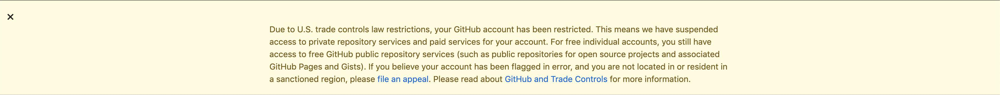

# A Message to GitHub

English | [简体中文](./README-CN.md) | [Español ](./README-ES.md) | [Ελληνικά](./README-GR.md) | [Italiano](./README-IT.md) | [Русский](./README-RU.md) | [فارسی](./README-PER.md) | [Français ](./README-FR.md) | [Deutsch](./README-DE.md) | [Հայերէն](./README-HY.md) | [Српски](./README-SR.md) | [العربية](./README-AR.md) | [Türkçe](./README-TR.md) | [Português do Brasil](./README-PT-BR.md) | [Nederlands](./README-NL.md) | [한국어](./README-KO.md)

~~**Tip:** You can use [this extension](https://github.com/JafarAkhondali/remove-github-restrictions-message) or [this extension](https://github.com/MohamadKh75/ShutHub) or [this tampermonkey script](https://gist.github.com/HirbodBehnam/2e079e187be0b1b6a6bcb734ed88474e) or [Stylish](https://userstyles.org/styles/173827/hide-github-warning) to hide this yellow box!~~

**UPDATE:** The warning message is dismissable now.

## Introduction

GitHub used to be an open and free platform for everyone, but it has decided to restrict Iranian accounts from contributing and being part of the open-source ecosystem. Although we understand GitHub might make this decision under the pressure of US government, we were expecting a more respectful action from GitHub.

1. GitHub restricted our access to private repositories suddenly, but at the very least we wanted GitHub to warn us before limiting our access.

2. GitHub decided to take one step further and ban every user that used Iran's IP address somewhere their history no matter where she/he is living, while they could just restrict access by IP address like other US-based companies. This action is kind of ban by nationality.

Eventually, we are hoping that GitHub's team will:

- Let us download our private repositories and gists and also make them public (setting control).
  **UPDATE:** It is possible now to make private repositories public, however this option is not available on private gists (containing IDE Setting Sync files etc.) yet.
- Change their restriction policies so as to not limit users based on their Nationality.
- Announce their decision publicly and apologize for making this situation (like what Slack did before in the same situation: https://slackhq.com/an-apology-and-an-update).
- **UPDATE** GitHub page are now working for restricted persons.

## Open-source projects made by Iranian developers

Some examples of open-source projects created by Iranian developers:

- [@harfbuzz](https://github.com/harfbuzz)/[**harfbuzz**](https://github.com/harfbuzz/harfbuzz)
- [@usablica](https://github.com/usablica)/[**intro.js**](https://github.com/usablica/intro.js)
- [@lebab](https://github.com/lebab)/[**lebab**](https://github.com/lebab/lebab)
- [@saeedalipoor](https://github.com/saeedalipoor)/[**icono**](https://github.com/saeedalipoor/icono)
- [@morteza](https://github.com/morteza)/[**bootstrap-rtl**](https://github.com/morteza/bootstrap-rtl)
- [@ilius](https://github.com/ilius)/[**pyglossary**](https://github.com/ilius/pyglossary)
- [@TheSNAKY](https://github.com/TheSNAKY)/[**Lives**](https://github.com/TheSNAKY/Lives)
- [@sasanrose](https://github.com/sasanrose)/[**phpredmin**](https://github.com/sasanrose/phpredmin)
- [@ahmdrz](https://github.com/ahmdrz)/[**goinsta**](https://github.com/ahmdrz/goinsta)
- [@persepolisdm](https://github.com/persepolisdm)/[**persepolis**](https://github.com/persepolisdm/persepolis)
- [@sepandhaghighi](https://github.com/sepandhaghighi)/[**pycm**](https://github.com/sepandhaghighi/pycm)
- [@sepandhaghighi](https://github.com/sepandhaghighi)/[**art**](https://github.com/sepandhaghighi/art)
- [@imaNNeoFighT](https://github.com/imaNNeoFighT)/[**fl_chart**](https://github.com/imaNNeoFighT/fl_chart)
- [@nuxt](https://github.com/nuxt)/[**nuxt.js**](https://github.com/nuxt/nuxt.js)
- [@bootstrap-vue](https://github.com/bootstrap-vue)/[**bootstrap-vue**](https://github.com/bootstrap-vue/bootstrap-vue)
- [@wolfengine](https://github.com/wolfengine)/[**wolf.engine**](https://github.com/wolfengine/wolf.engine)
- [@soroushchehresa](https://github.com/soroushchehresa)/[**vue-soundcloud**](https://github.com/soroushchehresa/vue-soundcloud)
- [@soroushchehresa](https://github.com/soroushchehresa)/[**unsplash-wallpapers**](https://github.com/soroushchehresa/unsplash-wallpapers)

You can find the full list [here](https://github.com/mohebifar/made-in-iran).

## How you can support us

You can spread the message everywhere you can, and keep the Free Software "as in Free speech".
You can:

- Star and share this repo on social platforms with **#githubForEveryone**.
- Add a folder with your username in ["together" folder](together).
- Write a piece of code that prints "GitHub is for everyone" (in any language you wish).
- Create a pull request.
- Add your name and your country to the [supporters section](#supporters).

## Further Readings

- [Microsoft enters: GitHub banned Iranian developers!](https://medium.com/@d.aliyamini/microsoft-enters-github-banned-iranian-developers-843f7c60a146)
- [GitHub banned Iran-based users](https://financialtribune.com/articles/sci-tech/99111/github-bans-iran-based-users)
- [GitHub has blocked an Iranian software developer account](https://hub.packtpub.com/github-has-blocked-an-iranian-software-developers-account)
- [GitHub starts blocking developers in countries facing US trade sanctions](https://www.zdnet.com/article/github-starts-blocking-developers-in-countries-facing-us-trade-sanctions)
- [What is it like to be a dev in Iran](https://shahinsorkh.ir/2019/07/20/how-is-it-like-to-be-a-dev-in-iran)
- [I am lucky, you are not](https://dev.to/jeromegamez/i-am-lucky-you-are-not-2eco)
- [If You Don't Know, Now You Know - GitHub Is Restricting Access For Users From Iran And A Few Other Embargoed Countries](https://dev.to/mjraadi/if-you-don-t-know-now-you-know-github-is-restricting-access-for-users-from-iran-and-a-few-other-embargoed-countries-5ga9)
- [محدود شدن اکانت های ایرانی‌ها روی گیت هاب](https://jadi.net/2019/07/github-sanctions)
- [GitHub blocked my account and they think I’m developing nuclear weapons](https://medium.com/@hamed/github-blocked-my-account-and-they-think-im-developing-nuclear-weapons-e7e1fe62cb74)
- [Yellow badges are back. This time not by Nazi Germany & not for Jews, but by U.S. tech companies](https://medium.com/@hamed/yellow-badges-are-back-this-time-not-by-nazi-germany-not-for-jews-but-by-u-s-tech-companies-48e92d690176)
- [Github: The largest developer communities from every corner of the globe, But Iran!](https://medium.com/@khalesic/github-the-largest-developer-communities-from-every-corner-of-the-globe-but-iran-804c05a991df)
## On Social Networks

- [GitHub banned all Iranian users.](https://www.reddit.com/r/programming/comments/ciey8g/github_banned_all_iranian_users_our_accounts_are/) on Reddit
- [Dan Abramov: Wow, looking forward to getting blocked from @GitHub when US decides to sanction Russia](https://twitter.com/dan_abramov/status/1154869188672086019?s=19) on Twitter
- [Hamed Saeedi: Today @github blocked my access](https://twitter.com/Hamed/status/1154268514074660864?s=19) on Twitter
- [Behdad Esfahbod: So, recently @github has started disabling accounts of Iranian developers](https://twitter.com/behdadesfahbod/status/1154755351092158465?s=19) on Twitter
- [Nuxt.js: Our core team member @_pi0_ cannot access our private repositories anymore on @github because of US Sanctions...](https://t.co/4FiLexH9Mf) on Twitter
- [Conner Orth:Shout out for this terribly sad turn of events for our fellow Iranian developers.](https://twitter.com/conner_orth/status/1154723522729709568) on Twitter
- [Nat Friedman:We're not doing this because we want to; we're doing it because we have to.](https://twitter.com/natfriedman/status/1155311121038864384) on Twitter
- [Pooya Eimandar:@github disabled my repos without prior notice.](https://twitter.com/_poei/status/1154994262884454400) on Twitter
- [Pooya Eimandar:I've been paid github for more than three years and now I can't even export my repos because of my nationality. ](https://www.reddit.com/r/github/comments/cirde7/ive_been_paid_github_for_more_than_three_years/?st=jympkq19&sh=df5e5410) on Reddit

## News

- [GitHub allow us to make our private repositories, public](https://github.com/1995parham/github-do-not-ban-us/issues/666)

- GitHub page are now working for restricted persons.

## Supporters

1995parham from iran 🇮🇷 (1995parham)
88250 from china 🇨🇳 (88250)
a c sreedhar reddy from india 🇮🇳 (a-c-sreedhar-reddy)
a764934018 from china 🇨🇳 (a764934018)
abdelhak bougouffa from algeria 🇩🇿 (abougouffa)
abdellah chadidi from morocco 🇲🇦 (chadidi)
abdelmomen kadhim (bluemix)
abdolreza taheri from iran 🇮🇷 (abdolrezat)
abdullrahman al-zeidi from oman 🇴🇲 (abdullrahmanalzeidi)
abdus from india 🇮🇳 (thisisabdus)
abhinaw singh from india 🇮🇳 (abhinaw-singh)
abi أب from indonesia 🇮🇩 (el7cosmos)
abolfazl amiri from iran 🇮🇷 (aasmpro)
adam yi from china and australia 🇨🇳 🇦🇺 (adamyi)
adaobi frank from nigeria 🇳🇬 (droidada)
adem kouki from tunisia 🇹🇳 (ademking)
adib faramarzi from iran 🇮🇷 (adibfara)
adnan babakan from iran 🇮🇷 (adnanbabakan)
ahad chowdhury from bangladesh 🇧🇩 (maacpiash)
ahmad aghazadeh from iran (ahmadaghazadeh)
ahmad chehreghani from iran 🇮🇷 (achehre)
ahmad habannakeh from syria 🇸🇾 (abnud1)
ahmad khani from iran 🇮🇷 (engineerahkhani)
ahmad salimi from iran 🇮🇷 (ahmadsalimi)
ahmad sharif from iran 🇮🇷 (bluemmb)
aiden wallis from the united kingdom (aidenwallis)
ainar-g from russia 🇷🇺 (ainar-g)
ajay rawat from india 🇮🇳 (hello-ajayrawat)
ajithkumar from india 🇮🇳 (ajithkumarsekar)
ako salman from iran 🇮🇷 (ako)
alejandro gonzález-pérez from spain 🇪🇸 (algope)
alexander j. from australia 🇦🇺 (alexanderj2357)
alexander shelepenok from belarus 🇧🇾
ali abdollahi from iran 🇮🇷 (aabdollahi)
ali amirnezhad from iran 🇮🇷 (webilix)
ali bakhtiar from iran 🇮🇷 (alibakhtiar)
ali bakhtiar from iran 🇮🇷 (faghani)
ali behrouzi from iran 🇮🇷 (alibh97)
ali farazdaghi from iran 🇮🇷 (alifarazz)
ali ghahremani from iran 🇮🇷 (ali77gh)
ali gholami from iran 🇮🇷 (aligholami)
ali gholami from iran 🇮🇷(aligholami)
ali hassanabadi from iran 🇮🇷 (ahassanabadi)
ali irani from iran 🇮🇷 (aliir74)
ali izadi from iran 🇮🇷 (aliizadi)
ali jalali from iran 🇮🇷 (aliprogrammer69)
ali joghataei from iran 🇮🇷 (ali-joghataei)
ali kavani from iran 🇮🇷 (subzerobo)
ali madihi from iran 🇮🇷 (mrunderline)
ali mohammadpur 🇮🇷 (alimpfard)
ali molaei from iran 🇮🇷 (molaeiali)
ali nasir from iran 🇮🇷 (ali nasir)
ali pirpiran from iran 🇮🇷 (alipirpiran)
ali piry from iran 🇮🇷 (alipiry)
ali ranjbarzadeh from iran (aliranjbarzadeh
ali salehi from iran 🇮🇷 (4lisalehi)
ali salehi from iran 🇮🇷 (alisalehi)
ali sameni from iran 🇮🇷 (aliwesome)
ali sharifi from iran 🇮🇷 (alisharifi2000)
ali tabatabaei from iran 🇮🇷 (alitabatabaeiat)
ali tavafi from iran 🇮🇷 (tavafi)
ali tavalaie from iran 🇮🇷 (tavallaie)
ali tavalaie from iran 🇮🇷(tavallaie)
ali yazdi from iran 🇮🇷 (aliyazdi75)
alireza edalatpour from iran 🇮🇷 (alirezaed)
alireza faghani from iran 🇮🇷 (faghani)
alireza heydari from iran 🇮🇷 (alirezahi)
alireza jahanshahlou from iran 🇮🇷 (a-jahanshahlo)
alireza mahmoudian (belegcuthalion)
alireza mahmoudian from iran 🇮🇷 (belegcuthalion)
alireza sabouri. from iran 🇮🇷 (alirezanet)
alireza sadeghi from iran 🇮🇷 (aliraza7926)
alireza sahebi from iran 🇮🇷 (alirzasahb)
alireza sheikholmolouki from iran 🇮🇷 (alireza29675)
alireza tarazani from iran 🇮🇷 (imanx)
alireza tarazani from iran 🇮🇷(imanx)
alireza torabian from iran 🇮🇷 (1997alireza)
alireza zerafati from iran 🇮🇷 (azerafati)
alireza zolanvari from iran 🇮🇷 (alirezazolanvari)
amer lotfi orimi from iran 🇮🇷 (amerllica)
ami from the us 🇺🇸 (memitaru)
amin mirzaee from iran 🇮🇷 (hifeamin)
amin nazari from iran 🇮🇷 (aminnazarii)
amin rashidbeigi from iran 🇮🇷 (aminrashidbeigi)
amin yazdanpanah from iran 🇮🇷 (aminyazdanpanah)
amine mouafik from thailand 🇹🇭 (kytwb)
amir baghaie from iran 🇮🇷 (amirbagh75)
amir ganji 🇮🇷 (amirgi73)
amir habibzadeh from iran 🇮🇷 (amirhabibzadeh)
amir haqiqati (anewage)
amir hossein mirzaei from iran 🇮🇷 (amirc901)
amir hossein sojoodi from iran 🇮🇷 (amirsojoodi)
amir m. joshaghani from 🇮🇷 (amjoshaghani)
amir masud zare bidaki from iran 🇮🇷 (amirmasud)
amir mohammad naderi from iran 🇮🇷 (amiiir)
amir ramezani from iran 🇮🇷 (brightening-eyes)
amir shokri from iran 🇮🇷 (amirshnll)
amir zandi from iran 🇮🇷 (amirzandi)
amirali esfandiari from iran 🇮🇷 (univa64)
amirerfanr rafati from iran 🇮🇷 (erfanr)
amirfeqhi from iran 🇮🇷(amirfeqhi)
amirhosein aliakbarian iran 🇮🇷 (amirhoseinaliakbarian)
amirhossein yaghoobi from iran 🇮🇷 (amir-yaghoobi)
anand chowdhary from india and netherlands 🇮🇳 🇳🇱 (anandchowdhary)
andreas basurto from the united states 🇺🇸 (nitrohorse)
andrii kovalchuk from ukraine 🇺🇦 (tieorange)
andrii siriak from ukraine (siriak)
andy shi from indonesia 🇮🇩 (andy-shi88)
angel uniminin from iceland 🇮🇸
angelo gazzola from italy 🇮🇹 (nglgzz)
angus l. fraser from uk 🇬🇧
antonios sidiropoulos from greece 🇬🇷 (s-i-d-i)
appadeia from the united states 🇺🇸
ardy a from turkey 🇹🇷 (ardyln)
aref anafgeh from iran 🇮🇷 (arefanafgeh)
aref hosseini from iran 🇮🇷 (arefhosseini)
aref m mehr from iran 🇮🇷 (arefmq)
arman hosseini from iran 🇮🇷 (arman-hosseini)
arman safikhani from iran 🇮🇷 (arman92)
armin abbasi from iran 🇮🇷 (armin-abbasi)
armin monirzadeh from iran 🇮🇷 (arminmon)
arseniy graur from russia 🇷🇺 (argraur)
artur kondas from poland 🇵🇱 (youshy)
ashish patel from india 🇮🇳 (a-patel)
atakan ermiş from turkey 🇹🇷 (atakanermis)
axel rindle from germany 🇩🇪 (axelrindle)
azkar moulana 🇱🇰 (azkarmoulana)
b1sergiu from romania 🇷🇴 (b1sergiu)
babak k. shandiz from iran 🇮🇷 (babakks)
bahman shams from iran 🇮🇷 (bahmanshams)
bahman shams from iran 🇮🇷(bahmanshams)
barce from the united states 🇺🇸 (barce)
barzin assa from iran 🇮🇷 (barzin144)
ben barnes from australia 🇦🇺 (ben-barnes)
benjamin hogué from guadeloupe 🇬🇵
benjamin sherman from the united states 🇺🇸(benjaminrsherman)
binbin huang from china 🇨🇳 (hbb)
bishoy melek from egypt 🇪🇬 (bishoymelek)
bofei wang china 🇨🇳 (bofeiw)
bohan wang from china 🇨🇳 (cygra)
brennen green from the united states (brennegreen)
carvell scott from the united states (carvellscott)
caspian baska from australia 🇦🇺 (caspiano)
charles jacquin from france 🇫🇷 (charjac)
charles milette from canada 🇨🇦 (sylveon)
chatchai saratakij from thailand 🇹🇭 (csaratakij)
chenzhen from china 🇨🇳 (xoinstein)
chris c from luxembourg 🇱🇺
chronosx88 from russia 🇷🇺 (chronosx88)
cihat gündüz from germany 🇩🇪 (dschee)
conner orth from netherlands 🇳🇱
cosmin-petru nechifor from romania 🇷🇴 (cosminnechifor)
cuong nguyen from vietnam 🇻🇳 (cuongw)
céleste cinti from france 🇫🇷 (leytere)
daniel caldas from portugal 🇵🇹 (danielcaldas)
daniel kvasnicka from czechia and the united states 🇨🇿 🇺🇸 (dkvasnicka)
daniel lalasa (daniellalasa2)
daniil gentili from italy and russia 🇮🇹 🇷🇺 (danog)
danny kamps from the netherlands 🇳🇱 (dkamps18)
darrien glasser from united states 🇺🇸 (darrieng)
davyd mccoll from south africa 🇿🇦 (fluffynuts)
deadblackclover from russia 🇷🇺 (deadblackclover)
dermohamad from iran (dermohamad)
dermohamad from iran 🇮🇷 (dermohamad)
dharani akurathi from india (dharni0607)
divinity1437 from russia 🇷🇺
dobro from russia 🇷🇺 (dobro)
doyin olarewaju from nigeria 🇳🇬 (gate3)
dražen perić from slovenia 🇸🇮 (peric)
duncan sparks from the united states 🇺🇸 (duncansparks)
duong nguyen from vietnam 🇻🇳 (you-create)
dylan cutler from the united states 🇺🇸 (dcthetall)
ebrahim hamzeh from iran 🇮🇷 (ebrahimhamzeh)
edgar from 🇦🇲 (edgaramirbekian)
ehsan ahmadi from iran 🇮🇷 (ehsana94)
ehsan mahmoudi from iran 🇮🇷 (jeyem)
ehsan mohammadi from iran 🇮🇷 (ehsan-mohammadi)
ehsan souri from iran 🇮🇷 (ehsansouri23)
elan bustos from the united states 🇺🇸(elanlb)
eli bierman from the united states 🇺🇸 (edbedbe)
eltrac from china 🇨🇳 (bigcoke233)
emilbek sulaymanov from kyrgyzstan 🇰🇬 (emli)
enzo from france 🇫🇷
erfan abedi from iran 🇮🇷 (theerfan)
erfan ahmadi from iran 🇮🇷 (erfan-ahmadi)
erfan alimohammadi from iran 🇮🇷 (erfaniaa)
erfan gholamian from iran 🇮🇷 (erfan-gh)
erfan gholizade from iran 🇮🇷 (erfantkerfan)
erfan mahdavi form iran 🇮🇷 (erfanwd)
erfan mehraban from iran 🇮🇷 (erfan-mehraban)
erfan momeni from iran 🇮🇷 (momenierfan)
erkan özkök from turkey 🇹🇷 (nozkok)
eziy from germany 🇩🇪 (eziy)
f-person from armenia 🇦🇲 (f-person)
fabian dellwing from germany 🇩🇪 (fdellwing)
fahim from bangladesh 🇧🇩
faiyaz shaikh from india 🇮🇳 (faiyaz shaikh)
farid forootan shad from iran 🇮🇷 (faridfor)
farshad jahanmanesh from iran 🇮🇷 (farshadjahanmanesh)
farshid roohi from iran 🇮🇷 (farshidroohi)
farzad sharbafian from iran 🇮🇷 (farzadshbfn)
farzin ghanbari from iran 🇮🇷 (farzinghanbari)
fateme bahrami from iran 🇮🇷 (fatibahrami771998)
fırat eşki from turkey 🇹🇷 (firateski)
fishplusorange from china 🇨🇳 (fishplusorange)
florian wartner from germany 🇩🇪 (fwartner)
francisco sánchez from chile 🇨🇱 (fransafu)
françois d from belgium be (altnabla)
fredddie from mexico 🇲🇽
fugio from armenia 🇦🇲 (fugio)
fzsdi from iran 🇮🇷 (fzsdi)
gaurav agarwal from india 🇮🇳 (gauravagarwal2704)
george ajam from iraq 🇮🇶 (geoapi)
george ho from hong kong 🇭🇰 (eigenfoo)
george zou from china 🇨🇳 (georgezou)
gerasimos maropoulos from greece 🇬🇷 (kataras)
gilberto dos santos agostinho filho from brazil 🇧🇷 (gilbertohasnofb)
giovanni nuño from mexico 🇲🇽 (gionuno)
gokul swaminathan from the united states 🇺🇸 (javacafe01)
guga nemsitsveridze from georgia 🇬🇪 (guganems)
habib kazemi from iran 🇮🇷 (kazemihabib)
hadi khaghani from iran 🇮🇷 (khaqani)
hadi mahdavi from iran 🇮🇷 (iot)
haider ali punjabi (haideralipunjabi)
hamed hajiloo from iran 🇮🇷 (hamedhajiloo)
hamed mirzaei from iran 🇮🇷 (hamedmiir)
hamed zargaripour from iran 🇮🇷 (zargaripour)
hamid from from iran 🇮🇷 (proghamid)
hamid from iran 🇮🇷 (proghamid)
hamid nasr from iran 🇮🇷 (hamidne)
hamid r. k. pishghadam from iran 🇮🇷 (hamidrezakp)
hamid rahmani from iran 🇮🇷 (hamiiiiiiid)
hamid taheri from iran 🇮🇷 (h4mit)
hamidreza adib from iran 🇮🇷 (hamidrezaadib)
hamidreza moallem taheri from iran 🇮🇷 (hrmt2000)
hao wu from japan 🇯🇵 (wheatup)
hasan ramezani from iran 🇮🇷 (hramezani)
heman from the united states 🇺🇸 (hemangandhi
henry huang from china 🇨🇳 (henryhuang)
henry ruhs from germany 🇩🇪 (redaxmedia)
hesam kaveh from iran 🇮🇷 (hesamkaveh)
higoka from switzerland 🇨🇭 (higoka)
himself65 from china 🇨🇳 (himself65)
hirbod behnam from iran 🇮🇷 (hirbodbehnam)
hiroto fukui from japan 🇯🇵 (bary822)
hossein mohammadi from iran 🇮🇷 (hosseinmd)
hossein shabani from iran 🇮🇷 (hosseinshabani)
houari zegai from algeria 🇩🇿 houarizegai
hussein habibi juybari from iran 🇮🇷 (husseinhj)
ibtehaz shawon from bangladesh 🇧🇩 (ibtehaz-shawon)
igor from poland 🇵🇱 (igorpos)
iman heydarifrom from iran 🇮🇷 (hamyarwoo)
iman khoshabbi from iran 🇮🇷 (imanneofight)
iman khoshabbi from iran 🇮🇷 (imanneofight)
imed adel from tunisia 🇹🇳 (imedadel)
imed jaberi from tunisia 🇹🇳 (3imed-jaberi)
inline harper from china 🇨🇳 (afanyiyu)
ioannis krommydas from greece 🇬🇷 (ioannis-krommydas)
isabelle l. from the united states 🇺🇸 (ilsko)
itswajdy from syria 🇸🇾 (itswajdy)
ivanq from russia 🇷🇺 (imachug)
iyotetsuya from taiwan 🇹🇼 (iyotetsuya)
jack kamm from the united states 🇺🇸 (jackkamm)
james from china 🇨🇳 (jamesyangget)
james kitching from scotland 🇬🇧 (jachdich)
jan krüger from germany 🇩🇪 (waterfl0w)
jason c. mcdonald from united states 🇺🇸 (codemouse92)
jason kraus from the united states 🇺🇸 (zbyte64)
javad gholampoor from iran 🇮🇷 (javad10170)
jennifer shehane from united states 🇺🇸 (jennifer-shehane)
jingping fang from china 🇨🇳 (codesman.fang)
jkmpariab from iran 🇮🇷 (jkmpariab)
jocs from china 🇨🇳 (jocs)
jocs from china 🇨🇳 (jocs)
johan planchon from france 🇫🇷 (joxcat)
johannes sandjaja from indonesia 🇮🇩 (pussio)
john mactavish from china 🇨🇳 (gonearewe)
jonas gierer from germany 🇩🇪 (jgierer12)
jordan hart from the united states 🇺🇸 (jordanhart)
jose pita from from portugal 🇵🇹 (jpita)
joshua morrison from the united states 🇺🇸 (mrm21632)
josé javier rodríguez zas from cuba/spain 🇨🇺/🇪🇸 (jjavierdguezas)
julian ooi from malaysia 🇲🇾(julianooi)
junbo li from china 🇨🇳 (adhders)
jérôme gamez from germany 🇩🇪 (jeromegamez)
kamyar gerami from iran 🇮🇷 (kam2yar)
karim oulad chalha from morocco 🇲🇦 (karim88)
karol kulik from poland 🇵🇱 (mrk191)
kave mohammadi from iran 🇮🇷 (keomd)
kevin pennarun from france 🇫🇷 (kepennar)
khashayar ghamati from iran 🇮🇷 (khashayarghamati)
kiarash zarinmehr from iran 🇮🇷 (kiarash-z)
kitten king from india 🇮🇳 (kittenking)
kittinan from thailand 🇹🇭 (kittinan)
kizito akhilome from nigeria 🇳🇬 (akhilome)
kt from china and the united states 🇨🇳 🇺🇸 (ktachibanam)
kuba juszczyk from poland 🇵🇱 (ku8ar)
lakshmiprasad from india 🇮🇳 (lakshmiprasad)
laster k. from uk 🇬🇧 (lazerl0rd)
leihen from china 🇨🇳 (leihen)
leonard ginters from germany 🇩🇪 (l2ig)
lewis conroy from scotlabd (lewis conroy)
li chang wei from china 🇨🇳 (lichangwei)
liam from uk 🇬🇧 (xerbo)
liam kenneth from england (liam kenneth)
lokimonoton from indonesia 🇮🇩 (lokimonoton)
lory from the united states 🇺🇸 and iran 🇮🇷 (lorymi)
louay al-osh from syria 🇸🇾 (lalosh)
louis raymond from indonesia 🇮🇩 (ccxex29)
lpmvb from china 🇨🇳
lucas alencar from brazil 🇧🇷 (alencarlucas)
lucas bittencourt from brazil 🇧🇷 (lucasnaja)
luiz eduardo amaral from brazil 🇧🇷 (luxedo)
lukmi15 from germany 🇩🇪(lukmi15)
madiodio gaye from senegal 🇸🇳 (madiodio)
mahdi dibaiee from iran 🇮🇷 (mdibaiee)
mahdi ghiasi from iran 🇮🇷 (mahdighiasi)
mahdi ghiasi from iran 🇮🇷(mahdighiasi)
mahdi hosseini from iran 🇮🇷 (ghost1372)
mahdi malvandi from iran 🇮🇷 (mahdi-malv)
mahdi razavi from iran 🇮🇷 (m-razavi)
mahdi salmanzadeh from iran 🇮🇷 (salmanzadeh)
mahmoud eskandari from iran 🇮🇷 (mahmoud)
mahuton from benin 🇧🇯 (mahuton)
marco aceti from italy 🇮🇹 (marcobuster)
mariam arab from canada 🇨🇦 (mariamarab)
marjan jangholi from iran 🇮🇷 (jangholi)
martin dünkelmann from germany 🇩🇪 (martinx3)
martin král from czech republic 🇨🇿 (martinkral)
marwen from germany 🇩🇪 (mtrabelsi)
maryam mehrabian from norway 🇳🇴(marme660)
masoud dangchi from iran 🇮🇷 (therealgadfly)
masoud tavakkoli from iran 🇮🇷 (promasoud)
mateus gabi moreira from brazil 🇧🇷 (mateusgabi)
matheus graciano from brazil 🇧🇷 (graciano)
matteopieroni from italy 🇮🇹 (matteopieroni)
matthew parnell from uk 🇬🇧 (parnmatt gitlab, parnmatt github)
matthias s from germany 🇩🇪 (raincode)
mavromatakis dimitris from greece 🇬🇷 (damavrom)
max base (basemax)
max rodrigo from spain 🇪🇸(maxrodrigo)
max strübing from germany 🇩🇪(mstruebing)
md narimani (mnarimani)
mehdi dehghani from iran (dehghani-mehdi)
mehmet alp turkey (mehmetakifalp)
mehmet kaykısız from turkey 🇹🇷 (mkaykisiz)
mehrad sadeghi from iran 🇮🇷 (mehradsadeghi)
mehran goudarzi from iran 🇮🇷 (mehran)
mehran mahmoudkhani from iran 🇮🇷 (mome13)
mehran motiee from iran 🇮🇷 (straxico)
mehran rafiee from iran 🇮🇷 (mehran75)
mehran rasoli from iran 🇮🇷 (mehranrasoli)
melika barzegaran from iran 🇮🇷 (melikabarzegaran)
meysam gheysaryan from ir (meysam7289)
michael power from canada 🇨🇦 (mwpower)
michele riva from italy 🇮🇹 (micheleriva)
michiel bakker from the netherlands 🇳🇱 (jaffog)
mighty9245 from russia 🇷🇺
mihir chaturvedi from india 🇮🇳 (plibither8)
milad barazandeh from iran 🇮🇷 (miladbarazandeh)
milad ganjali from iran 🇮🇷 (miladganjali)
milad nekofar (nekofar)
mindaugas vaitiekūnas from lithuania 🇱🇹 (mindaugasw)
mo zargham from canada 🇨🇦🇮🇷 (mozar10)
mohamad fadavi (fadavi)
mohamadkh75 from iran 🇮🇷 (mohamadkh75)
mohamed anees from india 🇮🇳 (mohamedanees6)
mohammad ali amini from iran (hakhsin)
mohammad ali sadraei from iran 🇮🇷 (mohalisad)
mohammad ali toufighi from iran 🇮🇷 (alitoufighi)
mohammad alian from iran 🇮🇷 (mdaliyan)
mohammad alijani from iran 🇮🇷 (virtualdemon)
mohammad amin chitgarha from iran 🇮🇷 (machitgarha)
mohammad bagherani from iran 🇮🇷 (bagherani)
mohammad ebrahimi aval from iran 🇮🇷 (ebrahimiaval)
mohammad eftekhari from iran 🇮🇷 (bluemmb)
mohammad ganji from iran 🇮🇷 (mohganji)
mohammad ghonchesefidi from iran 🇮🇷 (ghonchesefidi)
mohammad hadi hosseinpour from iran 🇮🇷 (hadi77ir)
mohammad hosein mighani from iran 🇮🇷 (mhmighani)
mohammad hussein tavakoli bina from iran 🇮🇷 (mhtb32)
mohammad javad naderi from iran 🇮🇷 (mjnaderi)
mohammad mahabadi from iran 🇮🇷 (thisismahabadi)
mohammad mahdi bakhshi from iran 🇮🇷 (thantez)
mohammad mahdi ramezanpour from iran 🇮🇷 (ramezanpour)
mohammad mahdi rostamzadeh from iran 🇮🇷 (favecode)
mohammad mehdi ahmadi from iran 🇮🇷 (tzab2ma)
mohammad moallemi from iran 🇮🇷 (mmoallemi99)
mohammad najafian from iran 🇮🇷 (loverdeveloper)
mohammad reza kamalifard from iran 🇮🇷 (reza kamalifard)
mohammad salek from iran 🇮🇷 (mohammadsalek)
mohammad zare moghadam 🇮🇷 (thisismzm)
mohammadamin samiazar from iran 🇮🇷 (samiazar)
mohammadhossein bagheri from iran 🇮🇷 (pybagheri)
mohammadhossein shojaeinia from iran 🇮🇷 (mohammadhosseinshojaeinia)
mohammadreza samadi from iran 🇮🇷 (mhmdsmdi)
mohsen darestani farahani from iran 🇮🇷 (8luemeth)
mohsen from canada 🇨🇦 (darkchocolate)
mohsen khanpour from iran 🇮🇷 (mohsenkhanpour)
mojtaba ahadi from iran 🇮🇷 (mojtaba)
mojtaba valipour from iran 🇮🇷 (mvpcom)
morteza from iran 🇮🇷 (asadise)
morteza karimi from iran 🇮🇷 (mortezakarimi)
morteza nokhodian from germany 🇩🇪 (nokhodian)
morteza omidian iran 🇮🇷
morteza t. from iran 🇮🇷 (yekanchi)
mostafa asadi from iran 🇮🇷 (mostafaasadi)
mostafa ghadimi from iran 🇮🇷 (mostafaghadimi)
mostafa khaki from iran (mosi-kha)
mostafa nazari from iran 🇮🇷 (rxdelta)
mostafa rowghanian from iran 🇮🇷 (keomd)
mrloder from spain 🇪🇸
mrtarkhan from iran 🇮🇷 (mrtarkhan)
msadeghzadehg from iran 🇮🇷 (msadeghzadehg)
muhammad azhdari from 🇮🇷 (muhammad azhdari)
muhammad babayi from iran 🇮🇷 (chiefmb)
muhammad hussein fattahizadeh from iran 🇮🇷 (mhf-ir)
muhammad javad falahi from iran 🇮🇷 (mjfalahi)
muhammad javad falahi from iran 🇮🇷 (mjfalahi)
muhammad yaseen from pakistan 🇵🇰 (yaseen)
mujan from iran 🇮🇷 (mujan)
mustapha limam from tunisia 🇹🇳 (mustaphalimam)
nabil tharwat from egypt 🇪🇬 (kl13nt)
nabilthenoise from iran 🇮🇷 (dragon96nfs)
naser nourani from iran 🇮🇷 (machitgarha)
naser nourani from iran 🇮🇷 (nnourani)
natnij from china 🇨🇳 (natnij)
navid emami from iran 🇮🇷 (novid)
navid khazaee form iran 🇮🇷 (nkhdiscovery)
navid sarhady from iran 🇮🇷 (nawwid)
nikan dalvand (nikandlv)
nima amiri from iran 🇮🇷 (machitgarha)
nima amiri from iran 🇮🇷 (nimak)
nima habibkhoda from iran 🇮🇷 (nimahkh)
nobel from nepal 🇳🇵 (coderkoala)
omar2535 from canada 🇨🇦 (omar2535)
omid rafiee from iran 🇮🇷 (omidrafiee)
orestis ousoultzoglou from greece 🇬🇷 (xlxs4)
orçun from turkey 🇹🇷 (0x01h)
parham from iran 🇮🇷 (parhambz)
parsa khosh from iran 🇮🇷 (parsakhosh)
parsa samadnejad from iran 🇮🇷 (troddenspade)
parsa torbati from iran 🇮🇷 (poyynt)
pashootan vaezipoor from iran and canada 🇮🇷 🇨🇦 (cphaddock)
persian prince from iran 🇮🇷 (persianpros)
pesehr from iran 🇮🇷 (pesehr)
peter nelson from the united states 🇺🇸 (pdtnelson)
peter stensby from norway 🇳🇴 (pstensby)
pexcn from taiwan 🇹🇼 (pexcn)
piotr kazimierski from poland 🇵🇱 (inquis1t0r)
pooya barati from iran 🇮🇷 (pooyabarati)
pooya eimandar from iran 🇮🇷 (pooyaeimandar)
pooya khandel from iran 🇮🇷 (po_oya)
pooya parsa from iran 🇮🇷 (pi0)
pouya kary from iran 🇮🇷 (pmkary)
praveen kumar saini from india 🇮🇳 (praveen-me)
raben2 from germany 🇩🇪 (raben2)
ragty from china 🇨🇳 (ragty)
rahmanism from iran 🇮🇷 (rahmansim)
rajabiseraji from iran 🇮🇷
ran luo from china 🇨🇳
rashad ansari from iran 🇮🇷 (rashadansari)
ravi from india 🇮🇳 (xolve)
ravi sharma from india 🇮🇳 (ravi-sharma)
realpg from china 🇨🇳 (realpg)
resaqulyubi from indonesia 🇮🇩 (resaqulyubi)
reza aghajani from iran 🇮🇷 (jrezaw)
reza bayat from iran 🇮🇷 (rezabayat)
reza hosseinzadeh from iran 🇮🇷 (rezamax)
reza kakhki from iran 🇮🇷 (elk-cloner)
ri7nz from indonesia 🇮🇩 (ri7nz)
richard merryfield from the united states 🇺🇸(labadore)
robert de bock from the netherlands 🇳🇱 (robertdebock)
robert fridzema from the netherlands 🇳🇱 (fridzema)
rogério dos santos fernandes from brazil 🇧🇷 (spartanroger)
rohit joshi from nepal 🇳🇵 (rohitjoshi21)
romain from france 🇫🇷 (maoschanz)
ron from the uk 🇬🇧 (noisytoot)
ru chern chong from singapore 🇸🇬 (ruchern)
ruslan gunawardana from ukraine 🇺🇦 (exarus)
rustam from russia 🇷🇺 (rs-hub)
s. mahdi mir-ismaili from iran 🇮🇷 (mirismaili)
sadra hallaj from iran 🇮🇷 (sadrahallaj)
sadra hallaj from iran 🇮🇷(sadrahallaj)
saeed bibak from iran 🇮🇷 (saeedbibak)
saeed mohagheghi from iran 🇮🇷 (saeedmhq)
saeed salhi from iran 🇮🇷 (1saeedsalehi)
saeid doroudi from iran 🇮🇷 (doroudi)
saleh from saudi arabia 🇸🇦 (qirh)
saleh salehizadeh from iran 🇮🇷 (sirsaleh)
salim djerbouh from algeria 🇩🇿 (caddydz)
salman amintabar from iran 🇮🇷 (amintabar)
sam johnson from the united states 🇺🇸 (sam0x17)
saman fekri from iran 🇮🇷 (samanfekri)
saman khamesian from iran 🇮🇷 (samankhamesian)
saman khamesian from iran 🇮🇷(samankhamesian)
saman zahedi from iran 🇮🇷 (thezahedi)
samet günaydın from turkey 🇹🇷 (rokumatsumoto)
samundra khatri from nepal 🇳🇵 (samundrak)
sandy chen from china 🇨🇳 (sandy2008)
sarah akhavan kazemzadeh (sarahakhavan)
sarah aziziyan from iran 🇮🇷 (sarahaziziyan)
saud from india 🇮🇳 (rottencandy)
saulo nunes from brazil 🇧🇷 (saulonunes)
scvoet from china 🇨🇳 (scvoet)
seamus donnellan from australia 🇦🇺 (donnellan0007)
selman samet from turkey 🇹🇷 (selmansamet)
sepand haghighi from iran 🇮🇷 (sepandhaghighi)
sepand haghighi from iran 🇮🇷(sepandhaghighi)
sepehr sameni from iran 🇮🇷 (separius)
sepehr taghdisian from iran 🇮🇷 (septag)
sepideh abadpour from iran (sepideh abadpour)
serene husni from jordan and canada 🇯🇴 🇨🇦
seyed abbas ghomi from iran 🇮🇷 (seyedabbasghomi)
seyed ali salmabadi from iran 🇮🇷 (salis77)
seyed ali shahrokhi from iran 🇮🇷 (alishahrokhiii)
seyed hossein (sedhossein) hosseini from iran 🇮🇷 (sedhossein)
seyed hossein hosseini from iran 🇮🇷 (dinimad)
seyed morteza kamali from iran 🇮🇷 (kamali)
shahrokh mirzayee from iran 🇮🇷 (shahrokh-mi)
shahrokh moghimi from iran 🇮🇷 (shaahrokh)
shailen naidoo za (shailennaidoo)
shakiba moshiri from iran 🇮🇷 (k-five)
shayan karami from iran 🇮🇷 (shayank)
shitoudev from china 🇨🇳 (shitoudev)
shreyas minocha from india 🇮🇳 (shreyasminocha)
siamak a.motlagh from iran 🇮🇷 (blacksrc)
silencehs from china 🇨🇳 (silencehs)
simon bäumer from germany 🇩🇪 (simonbaeumer)
simon lecutiez from france 🇫🇷 (soetz)
simon tas from belgium 🇧🇪 (nomis6432)
sina dalvand from iran 🇮🇷 (sinadalvand)
sina darvishi from iran 🇮🇷 (sinadarvi)
sina darvishi from iran 🇮🇷 (sinadarvi)
sina kachoei from iran 🇮🇷 (sinakachoei)
sina sheikholeslami from iran 🇮🇷 (ssheikholeslami)
sivuyile magutywa from south africa 🇿🇦
snailmann from china 🇨🇳 (snailmann)
sogrey from china 🇨🇳 (sogrey)
soroush chehresa from iran 🇮🇷 (soroushchehresa)
soroush kavousi from iran 🇮🇷 (bitianist)
speccius from uk 🇬🇧
stephen yin from china 🇨🇳 (hacker0limbo)
stijn segers from belgium 🇧🇪 (borromini)
sukka from china 🇨🇳 (sukkaw)
sutan gading fadhillah nasution from indonesia 🇮🇩 (sutanlab)
taher ahmadi from iran 🇮🇷 (taherahmadi)
tariqul islam from bangladesh 🇧🇩 (ta-riq)
taskeren from china 🇨🇳 (nitu2003)
thomas from united states 🇺🇸 (hakerh400)
tim visée from the netherlands 🇳🇱 (timvisee)
tipok from germany 🇩🇪 (tipok)
tobias aka. thedevminertv from germany 🇩🇪 (thedevminertv)
tom w from australia 🇦🇺 (tomicktwo)
tomas votruba from czech republic 🇨🇿 (tomasvotruba)
trinity pointard from france 🇫🇷 (fdb-hiroshima)
tristone13th from china 🇨🇳 (tristone13th)
twofist from germany 🇩🇪 (twofist)
tyler from the united states 🇺🇸 (arctair)
udo kramer from germany 🇩🇪 (optikfluffel)
vahid bazzaz from iran 🇮🇷 (vahidbazzaz)
vahid sadeghizadeh from iran 🇮🇷 (vsadeghizade)
vaibhav khulbe from india 🇮🇳 (kvaibhav01)
victor borges from brazil 🇧🇷 (v-borg)
vimiix yao from china 🇨🇳 (vimiix)
vincent hyvert from france 🇫🇷 (vinceh121)
vincent weevers from netherlands 🇳🇱 (vweevers)
wang yu from china 🇨🇳 (blogwy)
weixing from china 🇨🇳 (yutellite)
wenlongliu from china 🇨🇳 (gitors)
wilhelm behncke from germany 🇩🇪 (grebaldi)
william from netherlands 🇳🇱 (gusted)
wilson flores wilsson from 🇵🇪
xtlsoft from china 🇨🇳 (xtlsoft)
yanshigou from china 🇨🇳 (yanshigou)
yasin amini from iran 🇮🇷 (yasinenigma)
yağızhan burak yakar from turkey 🇹🇷 (yagizhan49)
yhlben from china 🇨🇳 (yhlben)
yhyj from china 🇨🇳 (yhyj)
zhiwa from china 🇨🇳 (zhiwa)
zhu zihao from china 🇨🇳 (cireu)
ron with ❤️ from the united states and israel 🇺🇸 🇮🇱
şahin mersin from turkey 🇹🇷 (electrocoder)
